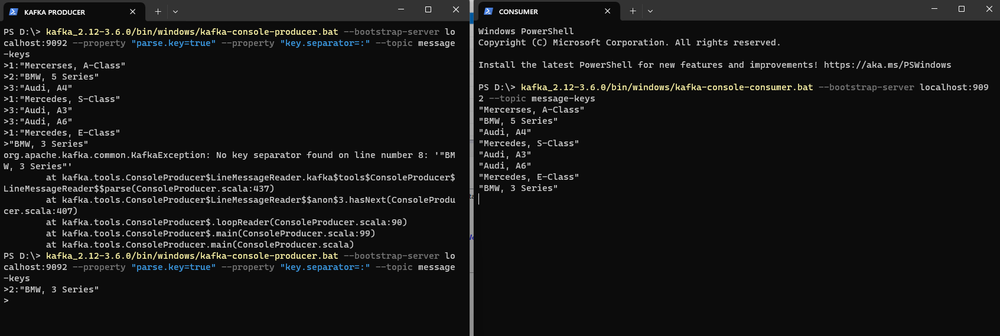
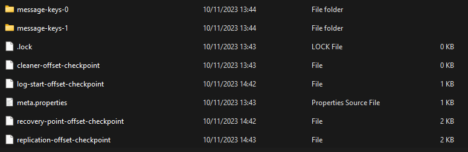
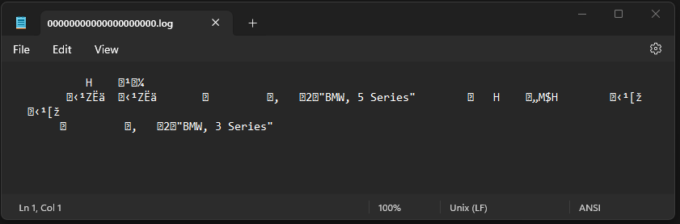
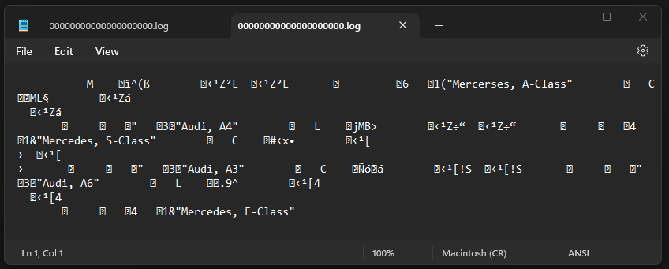
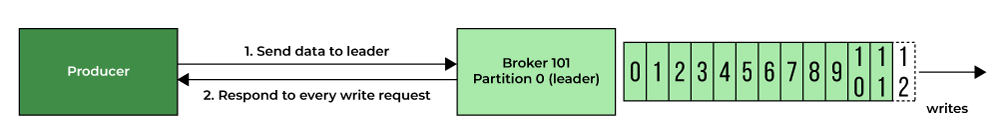
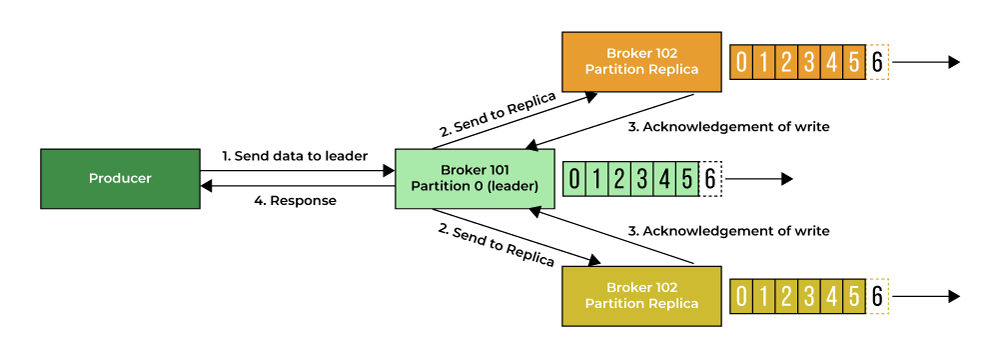
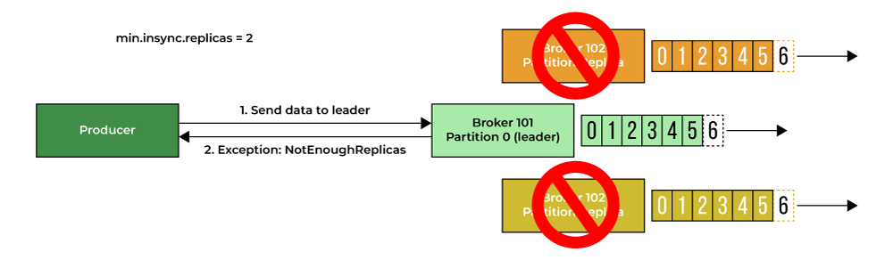

## Producer Message Key 

__How does a producer know how to send the data to a topic partition?__

In Apache Kafka, the producer is responsible for publishing records to Kafka topics. Each record consists of a key, a value (also known as data), and a timestamp. The producer key (or message key) and data management are essential components of how Kafka handles and organizes the data it processes. The key in Kafka is an optional field in the message. It serves as an identifier and plays a crucial role in message distribution across partitions within a topic. __Messages with the same key are guaranteed to go to the same partition within a topic, ensuring that related data stays together__. This aids in scenarios where order or affinity between messages is critical. If a producer sends multiple messages with the same key, Kafka ensures that they are sent to the same partition in the order they were produced, thus enabling deduplication based on the key.
Kafka uses the key to assign the message to a partition. The default partitioner algorithm hashes the key to determine the partition for the message. When a key is used, Kafka ensures that messages with the same key are sent to the same partition and maintain their order within that partition. This enables the preservation of message order for related data. Consumers reading from a topic can benefit from keys by ensuring they consume messages in a way that maintains the relationships between data points, especially if ordered processing is required.

In Apache Kafka, when a key is not explicitly passed with a message, key is set to null and the system resorts to a default message distribution mechanism called __"Round-robin"__ to determine how messages are assigned to partitions within a topic. __Round-robin__ message distribution refers to a simple strategy where Kafka evenly distributes messages across partitions within a topic in a cyclic or circular order. Essentially, messages are sent to partitions in a sequential order, rotating through each available partition. When a producer publishes a message without a key, Kafka's default partitioner assigns the message to a partition in a round-robin fashion. It typically uses a simple algorithm to determine which partition the message should be sent to. For instance, it might start from the first partition, then the second message goes to the second partition, the third to the third partition, and so on. When it reaches the last partition, it cycles back to the first partition and continues the sequence. The purpose of round-robin distribution is to evenly distribute the data load across partitions, ensuring that no single partition becomes overwhelmed with data while others remain underutilized.

NOTE: It's important to note that round-robin distribution does not consider any correlation or relationship between messages. Each message is treated independently, which might not suit scenarios where related messages need to be stored in the same partition for reasons like data ordering or related data co-location.

__To enable sending full key-value pairs, from command line, we need to use two properties as below:__

    1. __parse.key__ - default is false, if it is true then message key is required
    2. __key.separator__ 

To test what we just learned we will create new kafka cluster with 2 partition topic , start server (broker), producer and consumer and see how Kafka distributes data based on __Message Key__ values.

1. Start Kafka Zookeper with:
     kafka_2.12-3.6.0\bin\windows\zookeeper-server-start.bat  kafka_2.12-3.6.0\config\zookeeper.properties

2. Start Kafka broker:
    kafka_2.12-3.6.0\bin\windows\kafka-server-start.bat kafka_2.12-3.6.0\config\server.properties 

3. Create topic:
    kafka_2.12-3.6.0/bin/windows/kafka-topics.bat --create --topic message-keys --bootstrap-server localhost:9092 --replication-factor 1 --partitions 2

4. Start producer with enabled key-value pairs:
    kafka_2.12-3.6.0/bin/windows/kafka-console-producer.bat --bootstrap-server localhost:9092 --property "parse.key=true" --property "key.separator=:" --topic message-keys 

5. Lastly, start a consumer:
    kafka_2.12-3.6.0/bin/windows/kafka-console-consumer.bat --bootstrap-server localhost:9092 --topic message-keys

Now write this messages to your producer console (key separator is set to ":" , so term on the left of ":" is acting like key and term ond the right of ":" is acting like value - in our case comma separated value csv ):

1:"Mercerses, A-Class"
2:"BMW, 5 Series"
3:"Audi, A4"
1:"Mercedes, S-Class"
3:"Audi, A3"
3:"Audi, A6"
1:"Mercedes, E-Class"
2:"BMW, 3 Series"

On the image below you can se how consumer does not print out "key" but only value. Also you cen see error when you try to pass data without separator ("KAFKA PRODUCER" tab):

Now, when you go to the your kafka_logs directory you can see that your server have 2 folders for message-keys topic ( remember that we created topic with 2 partitions ):

When we go inside 1st partitoin (message-keys-0) and into log file we can see:

Two data points that have same key value ("2") are stored on the same partiton, in a sequence order they were produced in.

Also, when we go into 2nd partition directory (message-keys-1) and into a log file:

Messages with key values "1" and "3" (Mercedes and Audi respectively) are stored in 2nd partition, and every future message with key value of "1" or "3" will always be stored also. 
__All the messages that share the same key will always go to the same partition!__

## Message Acknowledgement

ache Kafka is crucial for ensuring the reliability of message delivery between Kafka brokers (servers) and clients (producers and consumers). The **acks** parameter (acknowledgement parameter) controls how many partition replicas must recieve the record before the producer can consider the write successful. This option has a significant impact on how likely messages are to be lost. Here’s how message acknowledgment works in Kafka:

**1. Producer Sends a Message**
    A Kafka producer sends a message or a batch of messages to a Kafka topic. The producer specifies the topic to which it wants to send the message.

**2. Acknowledgment Settings**
    Producers can configure the level of acknowledgment they require from Kafka brokers regarding the sent messages. There are three acknowledgment modes:

   1. **acks=0** (No acknowledgment): The producer doesn’t wait for any acknowledgment. It sends the message and doesn’t care if it’s received. This means that if broker goes offline or an exception happens and the broker did not receive the message, the producer will not know about it and the messages will be lost.
        

   
   2. **acks=1** (Leader acknowledgment): The producer waits for an acknowledgment from the leader broker of the topic partition where the message is sent. This means the message is considered sent once the leader broker confirms receipt (success response). If the message cant be written to the leader (the leader crashed and a new leader was not elected yet) the producer will receive an error response and can retry sendting the message, avoiding potential data loss.
        

   3. **acks=all** (Replica acknowledgment): The producer waits for acknowledgment from all in-sync replicas of the partition. This provides the highest level of durability and safety but can introduce more latency.
        

        __acks=all must be used in conjunction with **min.insync.replicas**. It is a broker and topic setting. If you set up the broker level, you can override it at the topic level. So, the most common setting for min.insync.replicas is:
            '''
            min.insync.replicas=2
        
        That means that at least two brokers that are insync replicas, including the leader, must respond that they have the data. Otherwise, you’ll get an error message. So, that means that if you use **replication.factor=3, min.insync.replica=2, and acks=all**, you can only tolerate one broker going down. Otherwise, the producer will receive an exception on Send. Here is a diagram to understand this concept.
        

**3. Broker Receives the Message**
    The Kafka broker responsible for the topic’s partition receives the message from the producer. If the acknowledgment mode is set to 0 or 1, the broker immediately acknowledges the receipt to the producer. In cases where acknowledgment mode is set to “acks=all,” the leader broker forwards the message to the in-sync replicas (ISR) of the partition. These replicas replicate the message to ensure durability.

**4. Acknowledgment from Replicas**
    Once the message is successfully replicated to all in-sync replicas, they acknowledge the receipt back to the leader broker. The leader broker then acknowledges this to the producer.

**5. Producer Receives Acknowledgment**
    The producer, based on the acknowledgment mode chosen, receives an acknowledgment once the required condition is met:

   1. For “acks=0,” it receives no acknowledgment.
   2. For “acks=1,” it receives an acknowledgment from the leader broker.
   3. For “acks=all,” it receives an acknowledgment only after all in-sync replicas have replicated the message.

**6. Retries and Error Handling**
    If the producer doesn’t receive the acknowledgment within a specified timeout or encounters an error, it can retry the message transmission according to its configured retry settings.

This acknowledgment mechanism ensures that messages are reliably delivered to Kafka topics while allowing producers to choose their preferred level of reliability and durability. The choice of acknowledgment mode depends on the specific use case and trade-offs between latency and reliability requirements.
