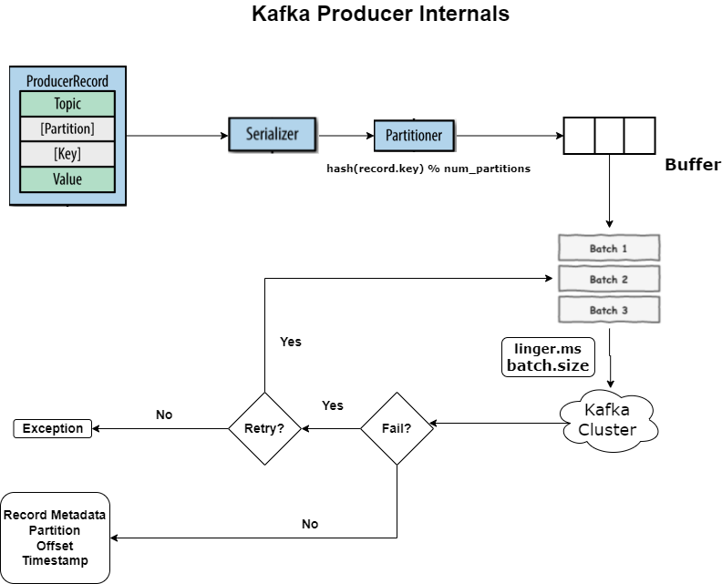

## Kafka Producer Internals

Kafka producers play a crucial role in the Kafka messaging system by producing data and sending it to Kafka topics. The Kafka producer workflow involves several key steps. Producers need to be configured with details such as the Kafka broker addresses, serialization settings for the data being sent, and other properties like acknowledgments, retries, and batching.

**Record Creation**: Producers create records/messages to be sent to Kafka. A record typically consists of a key, a value, and a topic. The key is used for partitioning, and the value is the actual data.

|

|

V

**Serialization**: The data needs to be serialized into bytes before it can be sent to Kafka. Common serialization formats include JSON, Avro, or Protocol Buffers. This step ensures that the data can be effectively transmitted and interpreted.

|

|

V

**Partitioning**: If a key is provided, Kafka uses it to determine the partition to which the record will be sent. If no key is given, Kafka uses a round-robin mechanism to distribute the records across partitions.

|

|

V

**Buffering**: Producers use buffers to store records before sending them to the broker. The buffer acts as a temporary holding area for messages that are yet to be transmitted. When a producer creates records, these records are stored in the buffer until they are ready to be sent in a batch. Buffering is crucial for a few reasons:

1.Reduced Network Overhead: Storing multiple messages in a buffer and sending them in a batch reduces the number of network calls required, optimizing network usage.

2.Increased Throughput: Batching messages in a buffer before sending them to Kafka improves overall throughput by minimizing the overhead associated with individual message transmissions.

3.Latency Management: By using buffering and batching, producers can manage latency effectively. However, the trade-off is that a longer buffering time might introduce some delay in sending messages.

|

|

V

**Batching**: Producers often batch multiple records together to optimize network and disk I/O. Batching reduces overhead by sending multiple records in fewer network requests, increasing throughput.

1.Batch Size (batch.size): This configuration parameter determines the maximum amount of data (in bytes) that a producer will include in a single batch before sending it to Kafka. It essentially sets the size threshold for creating a batch of messages. Smaller batches mean more frequent sends but potentially more overhead, while larger batches can improve throughput but might introduce higher latency.

2.Linger Time (linger.ms): This setting introduces a delay (in milliseconds) to allow more records to accumulate within a batch before sending. It works hand in hand with batch.size—if the accumulated records don't reach batch.size within the given linger.ms, the batch is sent anyway. Setting a higher linger.ms might improve batching efficiency by allowing more messages to collect within a batch before transmission.

|

|

V

**Compression**: Producers can compress batches of records to reduce the amount of data sent over the network, optimizing bandwidth usage.

|

|

V
**Acknowledgment Handling**: Producers can be configured to receive acknowledgments from brokers regarding the successful receipt of messages. This setting ensures reliability but may impact throughput.

|

|

V

**Retries and Error Handling**: If a message fails to be sent, producers can be configured to handle retries, allowing for a specified number of retries before giving up on sending a message.

|

|

V

**Metadata Management**: Metadata Retrieval: Producers fetch information about topics, partitions, and brokers before sending messages.Partitioning & Routing: Producers use this metadata to determine where messages should be sent. Offset & Timestamp Management: Producers track message positions and can attach timestamps to messages.
