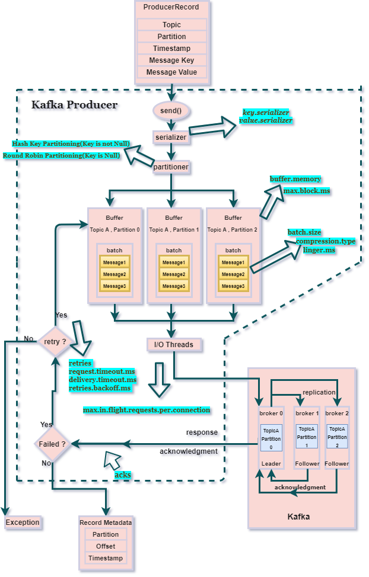
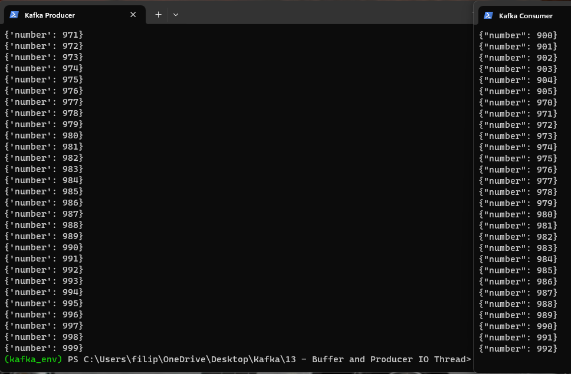
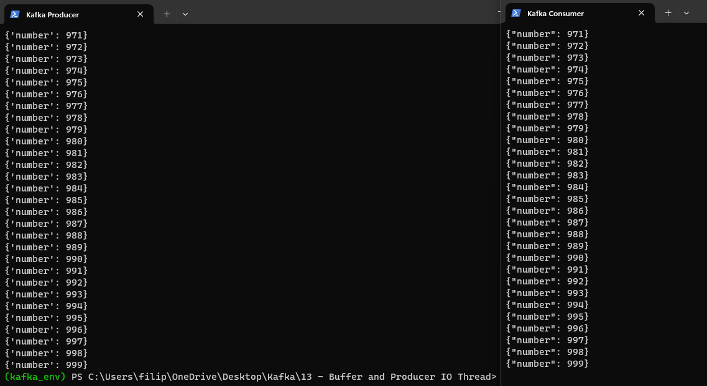

# Buffer and Producer IO Thread

We are learning about the internal architectures of the Kafka producer and the various components involved in sending/delivering the messages to the Kafka broker (topic -partition). This process is described with picture below:



**producer.send()** method adds the record to a buffer of pending records to be sent and returns immediately. This buffer of pending records helps to batch together individual records for efficiency. **Serializer** helps serialize the key and the value objects that the user provides with their ProducerRecord into bytes. **Partitioner** assigns partition to every ProducerRecord. There are two types of partitioning strategies:

-Round Robin Partitioning- This is used when the key is Null in ProducerRecord. Partitions are assigned in Round Robin fashion.

-Hash Key-based Partitioning- This is used when ProducerRecord has a key. Partitions are determined based on the hash of the key for a particular message/value.

, **buffer** of the unsent records is maintained by the producer for each partition. The size of the buffer can be set by the *batch.size config*. Background **I/O Threads** are responsible for turning the records in the buffer into requests and transmitting them to the Kafka broker.

The process of sending messages to Kafka brokers starts with creating a ProducerRecord which has the topic-name and the message-value. Message-key and/or a partition can also be mentioned in the ProducerRecord. ProducerRecord is then sent using send(). Now, the ProducerRecord arrives at the serializer where the key and value are serialized into ByteArrays to travel/be sent over the network. Now, the ProducerRecord arrives at the partitioner. If the partition is specified in the ProducerRecord, then the partitioner will return the same, otherwise, it will choose a partition for the message-value based on the partitioning strategy (Round Robin, Hash Key, or Custom Partitioning). Once a partition is determined, the producer adds the message-value to a batch of records that will be sent to the same topic and partition. This batch of unsent records is maintained in the buffer-memory. Once the message arrives at the buffer memory, the send() returns and starts processing the next ProducerRecord. A separate I/O thread is responsible for sending those batches of records as a request to the Kafka broker. When the broker successfully receives the messages, it will return a RecordMetadata object as response and it has the topic, partition, and offset of the record within the partition. If the message fails to be received by the broker, it will return an error as a response, and the producer may retry sending the message a few more times (No. of retries) before giving up and returning the error.

Lets explores some of batch and I/O thread configuration options:

**BATCHING**

   *batch.size* - This configuration controls the default batch size in bytes. The producer will attempt to batch multiple records together into fewer requests that are being sent to the same partition.
   *linger.ms* - Instead of sending a record as soon as possible, the producer will wait for linger.ms time before sending the record. This allows multiple records to be batched together. If linger.ms = 0 (it is default in Kafka), then as soon as one message comes into buffer it is send to Kafka Cluster (we are not allowing buffer to accumulate messages into buffer). That is what we would expect but if I/O Thread is not available (it is writing some previous message to Kafka Cluster), messages still get accumulated into buffer.

Batch request will be sent to the broker based on the following scenarios: 
   1) if batch.size worth of records arrive then a batch request will be sent. 
   2) if batch.size worth of records are yet to accumulate , then it will linger for a specified amount of time for more records to shows up.

Also, batching and lingering can increase the latency of the record sent but can reduce the number of requests to the broker.


**BUFFER MEMORY**

   *buffer.memory* - The total bytes of memory the producer can use to buffer records waiting to be sent to the server. This buffer is maintained for each topic partition. If messages from the producer.send() are coming too fast, and buffer memory is full, .send() method from producer is blocked for a particular span of time. That span of time we can configure with *max.block.ms*. For example, if the producer sends messages faster than they can be transmitted to the broker or there is a network issue, it will exceed buffer.memory ,and if we set max.block.ms = 5 (5 miliseconds), then .send will be blocked for 5 miliseconds and we can hope that, in the meantime, buffer can send some messages to I/O thread and free some space for new messages coming into buffer.

   **default *buffer.memory* is 32MB**

   *max.block.ms* - The configuration controls how long the Kafka producer’s send() methods will be allowed to remain blocked waiting for metadata fetch and buffer allocation. It throws an exception if the producer is in waiting state for more than  max.block.ms.


**EXAMPLE**
Start Kafka Zookeeper:
    
    kafka_2.12-3.6.0\bin\windows\zookeeper-server-start.bat  kafka_2.12-3.6.0\config\zookeeper.properties

Start Server:
    
    kafka_2.12-3.6.0\bin\windows\kafka-server-start.bat kafka_2.12-3.6.0\config\server.properties 

Create Topic:
    
    kafka_2.12-3.6.0/bin/windows/kafka-topics.bat --create --topic buffer-example --bootstrap-server localhost:9092 --replication-factor 1 --partitions 1

Start Consumer:
    
    kafka_2.12-3.6.0/bin/windows/kafka-console-consumer.bat --bootstrap-server localhost:9092 --topic buffer-example --from-beginning

Now, for the producer we will use python script (example.py) as follows:
```python

from time import sleep
from json import dumps
from kafka import KafkaProducer

topic_name='buffer-example'
producer = KafkaProducer( bootstrap_servers=['localhost:9092'], value_serializer = lambda x : dumps(x).encode('utf-8'))

for e in range (1000):
    data = {'number': e}
    print(data)
    producer.send (topic_name, value=data)
```

To run the script, go to folder where your script is located, open in terminal:

    python example.py

Here is what happened:



We can see that producer created 1000 records (0-999), but consumer consumed only 993 (0-992). Why did that happened?
Messages are very small in our example, so obviously buffer.memory (default is 32MB, and default is also linger.ms=0 --> no micro batching is allowed) is not exceeded and .send() method was not blocked. We are rapidly writting messages to buffer and I/0 thread is writing messages to Kafka cluster with a delay (because it takes time to write message to Kafka Cluster). So what happened is that some messages got accumulated into buffer. When our producer code is done, we are coming out of that code (because we are done), and some messages got trapped inside buffer. What we should do?

We should add 2 more properties, which are very important:
*producer.flush()* - This method is used to ensure that all records/messages sent by the producer are actually sent to the Kafka broker. It forces any outstanding messages in the producer's buffer to be sent to the broker immediately.

*producer.close()* - This method is used to close the producer. It is important to call close() before exiting your application to ensure that all resources used by the producer are properly released. This includes closing network connections to the Kafka brokers and releasing any resources associated with the producer. If you don't close the producer, it may lead to resource leaks. The producer might not be able to release network connections and other resources properly, which can have negative impacts on the performance and stability of your application.

```python

from time import sleep
from json import dumps
from kafka import KafkaProducer

topic_name='buffer-example'
producer = KafkaProducer( bootstrap_servers=['localhost:9092'], value_serializer = lambda x : dumps(x).encode('utf-8'))

for e in range (1000):
    data = {'number': e}
    print(data)
    producer.send (topic_name, value=data)

producer.flush() 
producer.close()
```

Now, everything works as expected:

