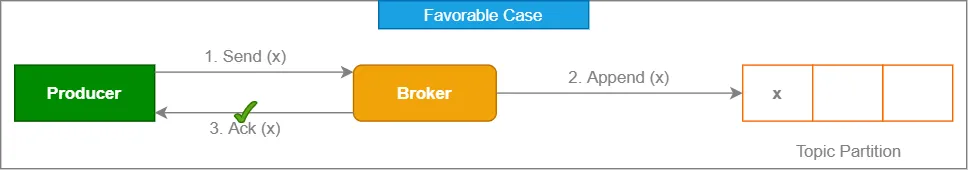
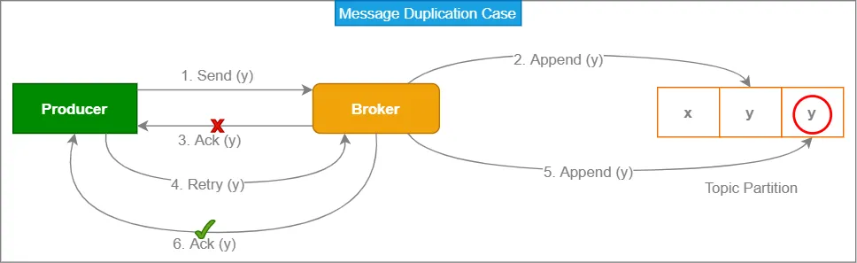
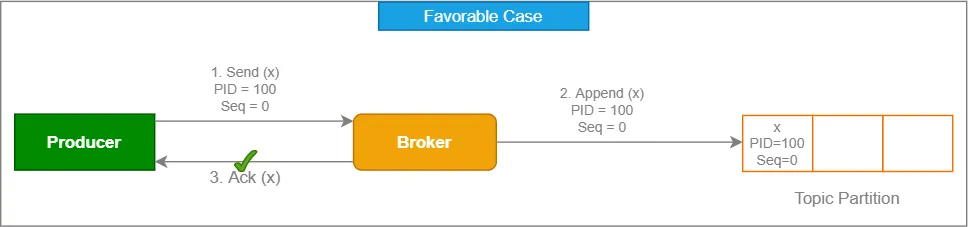
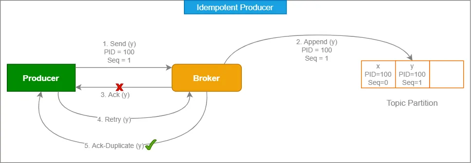

An idempotent producer in Kafka is a type of producer configuration that ensures that messages sent to a Kafka topic are not duplicated, even if there are failures in the producer or the Kafka broker. Idempotence guarantees that producing and sending a message will have the same effect as producing and sending it exactly once, even if the producer or broker encounters errors or failures.

# Duplicate Messages Problem

Let’s have a look about the problem. Below diagram represents a favorable case when a message is sent by producer to the broker and broker sends back acknowledgement to producer. All good so far.



Now, let’s have another scenario where a message sent by the producer to the broker but due to some issue acknowledgement does not come back to the producer. Producer retries and sends the same message again. Broker sends acknowledgement to producer and writes message again to topic partition. Now, we have duplicate message ie. y in this example.



Here we can see that acknowledgement failed led to message duplication.

# Idempotent Producer

Now, we’ll see how Kafka supports idempotent producers. Each producer assigned a unique Producer Id (PID). Producer always includes its PID every time it sends messages to a broker. In addition, each message gets a monotonically increasing sequence number. A separate sequence is maintained for each topic partition that a producer sends messages to. On the broker side, on a per partition basis, it keeps track of the largest PID-Sequence Number combination it has successfully written.



The broker will reject a producer request if its sequence number is not exactly one greater than the last committed message from that PID/TopicPartition pair as shown in below diagram. This ensures that, even though a producer must retry requests upon failures, every message will be persisted in the log exactly once. Further, since each new instance of a producer is assigned a new, unique, PID, we can only guarantee idempotent production within a single producer session.



# Idempotent Producer Configuration

To enable idempotence, you need to set the enable.idempotence configuration property to True when configuring your Kafka producer.

```python
from kafka import KafkaProducer

# Create a Kafka producer with idempotence enabled
producer = KafkaProducer(bootstrap_servers='your_kafka_broker', enable_idempotence=True)

```