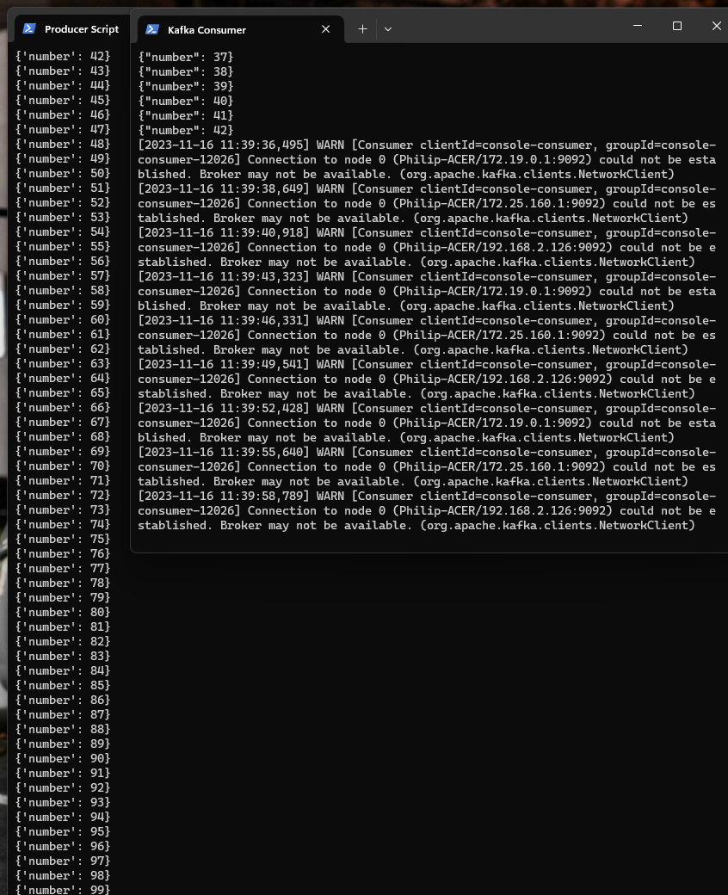
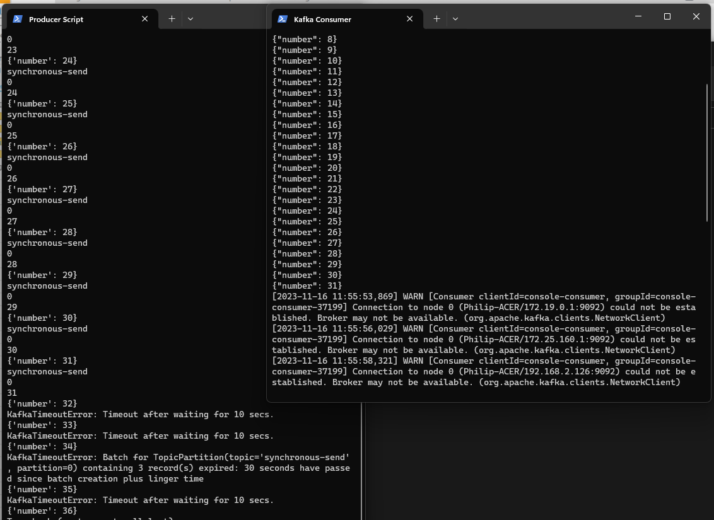
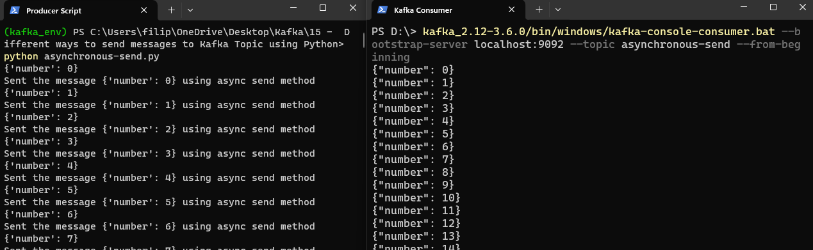
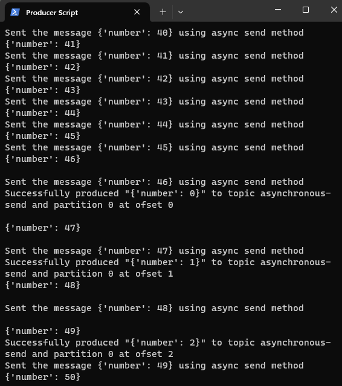
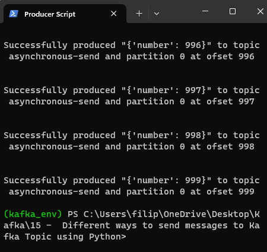
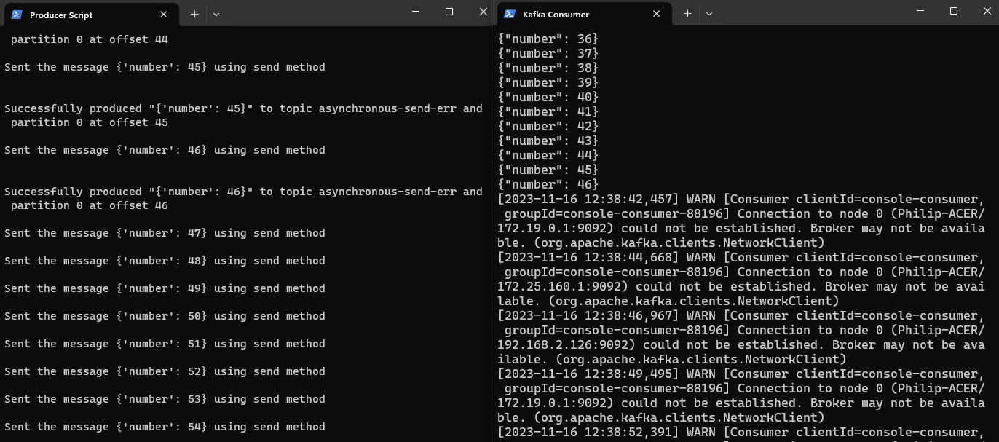
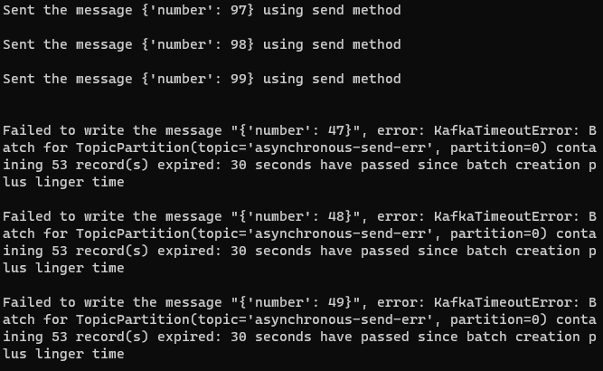

# Different ways to send messages to Kafka Topic using Python

There are three primary methods of sending messages:

**1. Fire-and-forget**
**2. Synchronous send**
**3. Asynchronous send**

**FIRE-AND-FORGET**

We send a message to the server and don't really care if it arrives successfully or not. Most of the time, it will arive sucessfully, since Kafka is highly available and the producer will retry sending messages automatically. However, some messages will get lost using this method

*example for Fire-and-forget*

Start Zookeeper:

    kafka_2.12-3.6.0\bin\windows\zookeeper-server-start.bat  kafka_2.12-3.6.0\config\zookeeper.properties

Start Server:
    
    kafka_2.12-3.6.0\bin\windows\kafka-server-start.bat kafka_2.12-3.6.0\config\server.properties 

Create Topic:
    
    kafka_2.12-3.6.0/bin/windows/kafka-topics.bat --create --topic fire-and-forget --bootstrap-server localhost:9092 --replication-factor 1 --partitions 1

Start Consumer:
    
    kafka_2.12-3.6.0/bin/windows/kafka-console-consumer.bat --bootstrap-server localhost:9092 --topic fire-and-forget --from-beginning

Producer will be our python script fire-and-forget.py:

```python
#Fire-and-forget

from time import sleep
from json import dumps
from kafka import KafkaProducer

topic_name = 'fore-and-forget'
producer = KafkaProducer(bootstrap_servers=['localhost:9092'], value_serializer = lambda x: dumps(x).encode('utf-8'))

for e in range (100):
    data = {'number': e}
    print(data)
    producer.send(topic_name,value=data)
    sleep(0.5)

```

After you start your producer script, wait until 40-50 records are produced and then crash server down itentionally (ctrl+c in your server terminal to terminate server). Let' see what happened.



Our Consumer is trying to reconnect to broker because our broker is down. In the meantime, our Producer is totally unaware of broker being down, it got to the end of the code without an error. Producer does not care if messages arrive to the destination successfully or not ('fire-n-forget'). Every message after record 43 is lost, because even if broker is up and running again, producer does not know that earlier messages has not been written to broker.

**SYNCHRONOUS SEND**

We send a message, the send() method returns a Future object, and we use get() to wait on the future and see if the send() was successful or not.

*example for Synchronous-send*

Start Zookeeper:

    kafka_2.12-3.6.0\bin\windows\zookeeper-server-start.bat  kafka_2.12-3.6.0\config\zookeeper.properties

Start Server:
    
    kafka_2.12-3.6.0\bin\windows\kafka-server-start.bat kafka_2.12-3.6.0\config\server.properties 

Create Topic:
    
    kafka_2.12-3.6.0/bin/windows/kafka-topics.bat --create --topic synchronous-send --bootstrap-server localhost:9092 --replication-factor 1 --partitions 1

Start Consumer:
    
    kafka_2.12-3.6.0/bin/windows/kafka-console-consumer.bat --bootstrap-server localhost:9092 --topic synchronous-send --from-beginning

Producer will be our python script synchronous-send.py:

```python
#Synchronous send

from time import sleep
from json import dumps
from kafka import KafkaProducer

topic_name = 'synchronous-send'
producer = KafkaProducer(bootstrap_servers=['localhost:9092'], value_serializer = lambda x: dumps(x).encode('utf-8'))

for e in range (100):
    data = {'number': e}
    print(data)
    try:
        record_metadata = producer.send(topic_name,value=data).get(timeout=10)
        print(record_metadata.topic)
        print(record_metadata.partition)
        print(record_metadata.offset)
        sleep(0.5)
    except Exception as e:
        print(e)

producer.flush()
producer.close()
```

Now, again terminate Kafka broker after 30-40 records are produced. We can see the different scenario compared to 'fire-and-forget' method:



Our producer client is getting notification that from record {'number':32}, producer is not able to send data to Kafka Cluster and after 10 seconds the Timeout error is thrown. We can store those notifications into log file and monitor when, why and which records failed. The biggest difference is that we are aware (as a Producer) of unsuccessful messages. The biggest disatvantage of this method is that producer will wait 10 seconds (actually based on timeout parameter value) for response and only after that period it will go on the next record. This method is slow and time-consuming.

**ASYNCHRONOUS SEND**

Suppose the network roundtrip time between our application and the Kafka cluster is 10ms. If we wait for a reply after sending each message, sending 100 messages will take around 1 second. On the other hand, if we send all our messages and not wait for any replies, then sending 100 messages will take barely any time at all. In most cases we really don't need a reply with topic, partition and offset af a record. But, what we do need to know is if and when  we failed to send message , throw an exception, log an error for later analysis.
In order to send messages asynchronously and stil handle error scenarios, the producer supports adding a callback when sending a record.

*example for Asynchronous-send*

Start Zookeeper:

    kafka_2.12-3.6.0\bin\windows\zookeeper-server-start.bat  kafka_2.12-3.6.0\config\zookeeper.properties

Start Server:
    
    kafka_2.12-3.6.0\bin\windows\kafka-server-start.bat kafka_2.12-3.6.0\config\server.properties 

Create Topic:
    
    kafka_2.12-3.6.0/bin/windows/kafka-topics.bat --create --topic asynchronous-send --bootstrap-server localhost:9092 --replication-factor 1 --partitions 1

Start Consumer:
    
    kafka_2.12-3.6.0/bin/windows/kafka-console-consumer.bat --bootstrap-server localhost:9092 --topic asynchronous-send --from-beginning

Producer will be our python script asynchronous-send.py:

```python
#Asynchronous send

from time import sleep
from json import dumps
from kafka import KafkaProducer

topic_name = 'asynchronous-send'
producer = KafkaProducer(bootstrap_servers=['localhost:9092'], value_serializer = lambda x: dumps(x).encode('utf-8'))

def on_send_success(record_metadata, message):
    print()
    print("""Successfully produced "{}" to topic {} and partition {} at offset {}""".format(message, record_metadata.topic,record_metadata.partition,record_metadata.offset))
    print()

def on_send_error(excp, message):
    print()
    print('Failed to write the message "{}", error: {}'.format(message, excp))

for e in range (1000):
    data = {'number': e}
    print(data)
    record_metadata = producer.send(topic_name,value=data).add_callback(on_send_success, message=data).add_errback(on_send_error, message=data)
    print("Sent the message {} using send method".format(data))

producer.flush()
producer.close()
```

After starting our producer, the proces was so fast that we cant possibly terminate our broker before process comes to it's end. But what actually happend:



Our producer client is producing records and our consumer is consuming those data. If you scroll down you can find that after already 46 messages are produced, there is a response message saying:



Messages keep on sending , and responses keep on coming after any messages successfully is written on Kafka cluster. After all messages are sent from producer to Kafka, then we are getting only success response messages, until last message is written to cluster.



This was a success scenario. Now we will write script that will allow us to intentionally put down the broker to see what happens.

Create Topic:
    
    kafka_2.12-3.6.0/bin/windows/kafka-topics.bat --create --topic asynchronous-send-err --bootstrap-server localhost:9092 --replication-factor 1 --partitions 1

Start Consumer:
    
    kafka_2.12-3.6.0/bin/windows/kafka-console-consumer.bat --bootstrap-server localhost:9092 --topic asynchronous-send-err --from-beginning

```python
#Asynchronous send with error

from time import sleep
from json import dumps
from kafka import KafkaProducer

topic_name = 'asynchronous-send-err'
producer = KafkaProducer(bootstrap_servers=['localhost:9092'], value_serializer = lambda x: dumps(x).encode('utf-8'))

def on_send_success(record_metadata, message):
    print()
    print("""Successfully produced "{}" to topic {} and partition {} at offset {}""".format(message, record_metadata.topic,record_metadata.partition,record_metadata.offset))
    print()

def on_send_error(excp, message):
    print()
    print('Failed to write the message "{}", error: {}'.format(message, excp))

for e in range (100):
    data = {'number': e}
    record_metadata = producer.send(topic_name,value=data).add_callback(on_send_success, message=data).add_errback(on_send_error, message=data)
    print("Sent the message {} using send method".format(data))
    print()
    sleep(0.5) # we add sleep so we can manually terminate our broker, without that the process is too fast

producer.flush()
producer.close()
```

Wait until some time and then terminate broker: 



What we can see is that after every record is sent, is the illusion of synchronous send (because of sleep = 0.5). But after broker is terminated , producer keeps on producing messages one after another not waiting for response. Consumer is trying to reconnect to broker. After some time we start receiving exceptions from our error handler callback:


