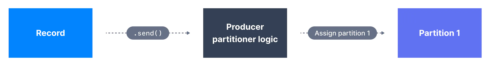
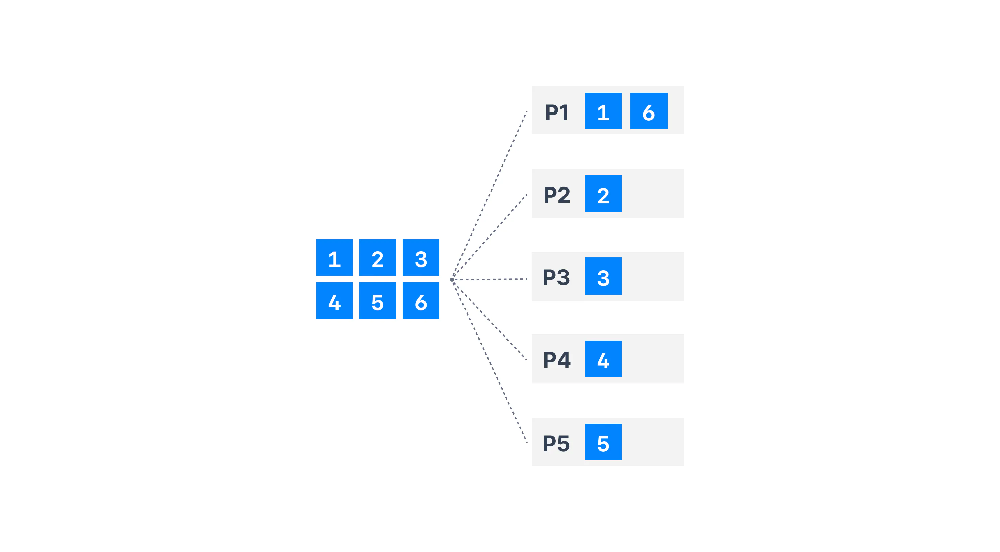
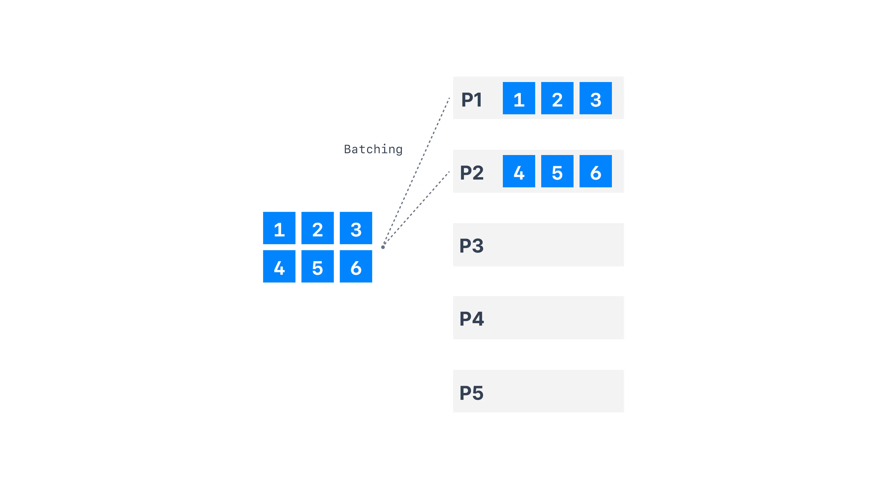
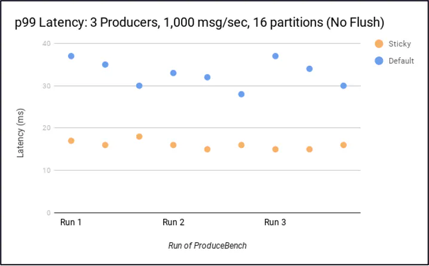
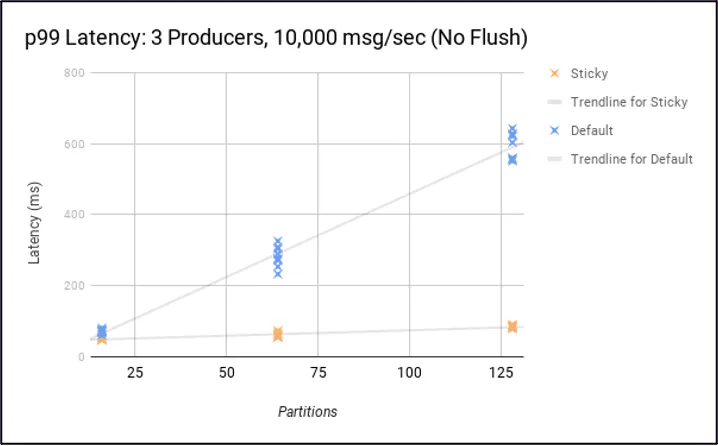

# Producer Default Partitioner & Sticky Partitioner

A partitioner is the process that will determine to which partition a specific message will be assigned to.

**Partitioner when key!=null**
Key Hashing is the process of determining the mapping of a key to a partition In the default Kafka partitioner, the keys are hashed using the murmur2 algorithm

```python
targetPartition = Math.abs(Utils.murmur2(keyBytes)) % (numPartitions - 1)
```

This means that same key will go to the same partition and adding partitions to a topic will completely alter the formula. It is most likely preferred to not override the behavior of the partitioner, but it is possible to do so using

'''
partitioner.class
'''



When key=null, the producer has a default partitioner that varies:

- Round Robin: for Kafka 2.3 and below

- Sticky Partitioner: for Kafka 2.4 and above

Sticky Partitioner improves the performance of the producer especially with high throughput.

**Round Robin Partitioner**
With Kafka ≤ v2.3, when there’s no partition and no key specified, the default partitioner sends data in a round-robin fashion. This results in more batches (one batch per partition) and smaller batches (imagine with 100 partitions). And this is a problem because smaller batches lead to more requests as well as higher latency.



**Sticky Partitioner**
It is a performance goal to have all the records sent to a single partition and not multiple partitions to improve batching.

The producer sticky partitioner will:

“stick” to a partition until the batch is full or linger.ms has elapsed

After sending the batch, change the partition that is "sticky"

This will lead to larger batches and reduced latency (because we have larger requests, and the batch.size is more likely to be reached). Over time, the records are still spread evenly across partitions, so the balance of the cluster is not affected.



Overall, there are some substantial performance improvements by using the Sticky Partitioner.

The latency is smaller:



And the latency in noticeably lower the more partitions you have.

