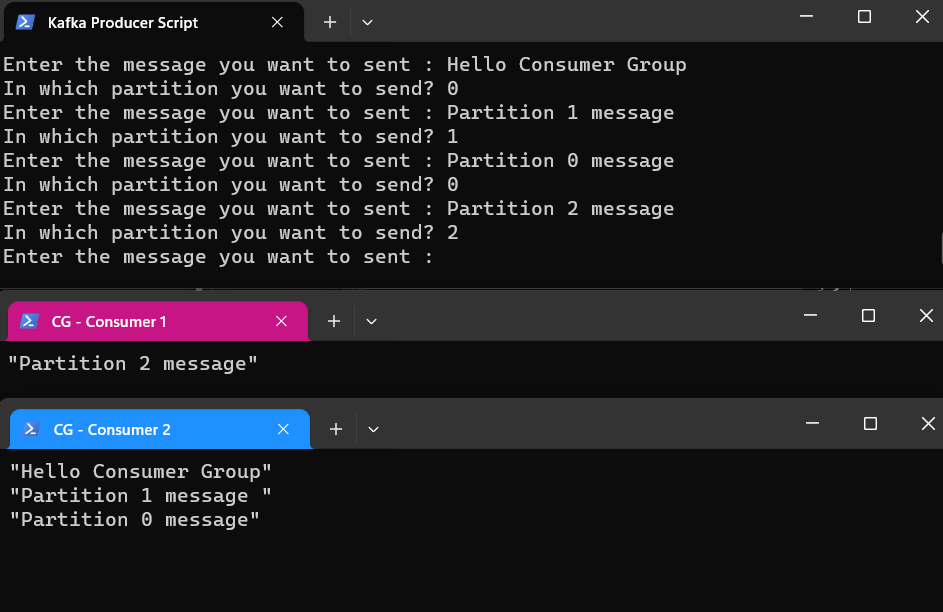

# Consumer and Consumer Group

**Consumer** in Kafka is an application or a process that subscribes to topics and processes the feed of published messages. Consumers pull messages from Kafka topics, and they can be designed to process the messages in real-time. Each consumer keeps track of its own offset (position) in each partition of the topic it consumes. This offset represents the location of the last message that the consumer has processed. Kafka consumers can be implemented in various programming languages, such as Java, Python, and others.

Suppoese you have an application that needs to read messages from a Kafka topic, run some validations against them , and write results to another data store.
In this case your application will create a consumer object, subscribe to the appropriate topic, and start receiving messages, validating them and writing the results. This may work well for a while, but what if the rate at which multiple producers write messages to the topic exceeds the rate at which your app can validate them? 

If you are limited to a single consumer reading and processing the data, your application may fall farther and farther behind, unable to keep up with the rate of incoming messages.

Just like multiple producers can write to the same topic, we need to allow multiple consumers to read from the same topic, splitting the data between them.

Kafka consumers are typically part of the a consumer group. When multiple consumers are subscribed to a topic and belong to the same consumer group, each consumer in the group will receive messages from a different subset of the partitions in the topic.

Let’s take topic T1 with four partitions. Now suppose we created a new consumer, C1, which is the only consumer in group G1, and use it to subscribe to topic T1. Consumer C1 will get all messages from all four T1 partitions. 


If we add another consumer, C2, to group G1, each consumer will only get messages from two partitions. Perhaps messages from partition 0 and 2 go to C1 and messages from partitions 1 and 3 go to consumer C2. 


If G1 has four consumers, then each will read messages from a single partition.


If we add more consumers to a single group with a single topic than we have partitions, some of the consumers will be idle and get no messages at all.


The main way we scale data consumption from a Kafka topic is by adding more consumers to a consumer group. It is common for Kafka consumers to do high-latency operations such as write to a database or a time-consuming computation on the data. In these cases, a single consumer can’t possibly keep up with the rate data flows into a topic, and adding more consumers that share the load by having each consumer own just a subset of the partitions and messages is our main method of scaling. This is a good reason to create topics with a large number of partitions—it allows adding more consumers when the load increases. Keep in mind that there is no point in adding more consumers than you have partitions in a topic—some of the consumers will just be idle.

In addition to adding consumers in order to scale a single application, it is very common to have multiple applications that need to read data from the same topic. In fact, one of the main design goals in Kafka was to make the data produced to Kafka topics available for many use cases throughout the organization. In those cases, we want each application to get all of the messages, rather than just a subset. To make sure an application gets all the messages in a topic, ensure the application has its own consumer group. Unlike many traditional messaging systems, Kafka scales to a large number of consumers and consumer groups without reducing performance.

In the previous example, if we add a new consumer group G2 with a single consumer, this consumer will get all the messages in topic T1 independent of what G1 is doing. G2 can have more than a single consumer, in which case they will each get a subset of partitions, just like we showed for G1, but G2 as a whole will still get all the messages regardless of other consumer groups. 


To summarize, you create a new consumer group for each application that needs all the messages from one or more topics. You add consumers to an existing consumer group to scale the reading and processing of messages from the topics, so each additional consumer in a group will only get a subset of the messages.

**Consumer Groups CLI**

Start Zookeeper:

    kafka_2.12-3.6.0\bin\windows\zookeeper-server-start.bat  kafka_2.12-3.6.0\config\zookeeper.properties

Start Server:
    
    kafka_2.12-3.6.0\bin\windows\kafka-server-start.bat kafka_2.12-3.6.0\config\server.properties 

Create Topic:
    
    kafka_2.12-3.6.0/bin/windows/kafka-topics.bat --create --topic consumer_group --bootstrap-server localhost:9092 --replication-factor 1 --partitions 3

Start Consumers without Consumer Group:
    
    kafka_2.12-3.6.0/bin/windows/kafka-console-consumer.bat --bootstrap-server localhost:9092 --topic consumer_group --from-beginning
    
    kafka_2.12-3.6.0/bin/windows/kafka-console-consumer.bat --bootstrap-server localhost:9092 --topic consumer_group --from-beginning

Producer code is below :
```python
from json import dumps
from kafka import KafkaProducer

topic_name = 'consumer_group'
producer = KafkaProducer(bootstrap_servers=['localhost:9092'], value_serializer = lambda x: dumps(x).encode('utf-8'))

while True:
    message = input ("Enter the message you want to sent : ")
    partition_no = int (input("In which partition you want to send? "))
    producer.send(topic_name, value = message, partiton = partition_no)

producer.close()
```

Firstly, we will start only one consumer and type 3 messages and put each message to one partition:


If we go into our server log directory we can see that there are 3 partitions for this topic (just as we created)


If we go into each of partition folders we can find that:

"Hello from partition 0" is written on partition 0 ,just as we instructed from our producer script
"Hello from partition 1" is written on partition 1 ,just as we instructed from our producer script
"Hello from partition 2" is written on partition 2 ,just as we instructed from our producer script


Our only consumer consumed all 3 messages.

Now, we will start our second consumer. Those 2 individual consumers have no connection between them, niether they have any knowledge about each other


Lets explore **Consumer Group** concept and how it differs from individual consumers subscribed to same topic.
To start consumer within a consumer group set a unique consumer group ID using the ```--group``` option:

    kafka_2.12-3.6.0/bin/windows/kafka-console-consumer.bat --bootstrap-server localhost:9092 --topic consumer_group --from-beginning --group my-consumer-group

    kafka_2.12-3.6.0/bin/windows/kafka-console-consumer.bat --bootstrap-server localhost:9092 --topic consumer_group --from-beginning --group my-consumer-group

Right at the start we can notice that, since we first started the first consumer with the flag ```--from-beginning```, it consumed all existent messages. After we started the second consumer within group, also with flag ```--from-beginning```, it does not consume any messages at all because the first consumer already did that.

 

In the background rebalancing is done and we can start producing messages and see how they are distributed.



We can notice that Consumer 1 from Consumer Group consumes messages from partition 2 and that Consumer 2 eats messages from partitions 0 and 1.

Now we will start 3rd consumer and the assumption is that each consumer will receive messages from 1 partition, because we have 3 consumers and 3 partitions.


If we added one more consumer, after rebalancing , 3 of the consumers will consume records from each of 3 partitions, and 1 consumer will be idle.