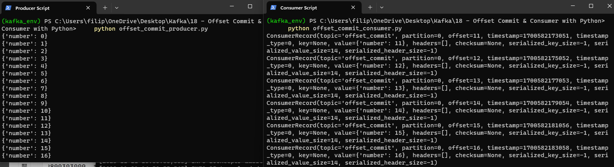
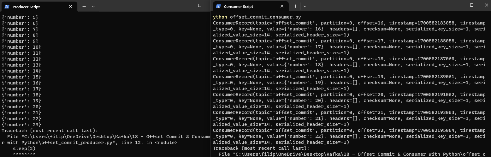

# Offset Commit & Consumer with Python

Let's say we have a topic with four partitions and a Consumer Group with four consumers consuming the messages from the topic using polling mechanism. It is important to understand that Kafka Consumer follows pull mechanism. Broker is not pushing messages to Consumer. Now let's say, for some reason situation happens where consumer 4 crashes, then rebalancing occurs. One of Kafka's unique characteristics is that it does not track acknowledgements from consumer. Kafka cluster has no knowledge how many messages have been processed by Consumer in a particular partition, or at what offset is Consumer currently consuming the massages from a particular partition. However, Consumer API itself can take responsibility of saving this kind of information. Let's get back to our example, after rebalancing Consumer 3 are responsible to consume messages from ex Consumer's 4 partition. But how does Consumer 3 know up until which offset Consumer 4 did the processing? It is obvious that if Consumer 3 starts at offset 0, reprocess of already proccessed messages would happen. The answer is **Offset Commit**. Consumers store (commit) offsets up to where they already completed processing in Kafka internal topic (created by Kafka and managed by Kafka) called ```__consumer_offset```. Consumer API ( wether Java or Python) is responsible for commiting offset information to ```__consumer_offset```. So, after rebalancing, new consumer responsible for partitiong of crashed consumer will first look into ```__consumer_offset``` and will start proccessing messages from one offset higher so no message reprocessing will happen.

What about initial situation, where there is not yet commited ```__consumer_offset```? How to determine initial offset, when consumer starts consuming topic partition messages for the fitst time?
The decision on whether to consume from the beginning of a topic partition or to only consume new messages when there is no initial offset for the consumer group is controlled by **auto.offset.reset** configuration on the Kafka Consumer.

The ```auto.offset.reset``` configuration has three possible values:

**"earliest"**: This is the default value. When a consumer subscribes to a topic for the first time or if it cannot find a valid offset for a partition, it will start consuming from the earliest available offset for that partition. In other words, it will begin reading messages from the beginning of the partition.

**"latest"**: If the consumer is unable to find a valid offset for a partition, it will start consuming from the latest available offset. This means the consumer will only receive messages that are produced after it starts.

**"none"**: If this value is set, and the consumer does not find a valid offset for a partition, it will throw an exception. This configuration can be useful if you want to ensure that the consumer never starts from the beginning or the latest offset automatically, and you always want to specify the offset explicitly.

Lets explore example

Start Zookeeper:

    kafka_2.12-3.6.0\bin\windows\zookeeper-server-start.bat  kafka_2.12-3.6.0\config\zookeeper.properties

Start Server:
    
    kafka_2.12-3.6.0\bin\windows\kafka-server-start.bat kafka_2.12-3.6.0\config\server.properties 

Create Topic:
    
    kafka_2.12-3.6.0/bin/windows/kafka-topics.bat --create --topic offset_commit --bootstrap-server localhost:9092 --replication-factor 1 --partitions 1

Our producer code in offset_commit_producer.py:

```python
from time import sleep
from json import dumps
from kafka import KafkaProducer

topic_name = 'offset_commit'
producer = KafkaProducer(bootstrap_servers=['localhost:9092'], value_serializer = lambda x: dumps(x).encode('utf-8'))

for e in range(1000):
    data = {'number' : e }
    print(data)
    producer.send(topic_name, value = data)
    sleep(2) 
```

Go to folder where *offset_commit_producer.py* is located, open in terminal and type:
```python offset_commit_producer.py ``` 
to start producing messages to topic.

Start the Consumer in command line :
    
    kafka_2.12-3.6.0/bin/windows/kafka-console-consumer.bat --bootstrap-server localhost:9092 --topic offset_commit --from-beginning

In Command Line we can also start Consumer in 2 ways --> with ```--from-beginning``` flag (will read messages from offset 0) or without ```--from-beginning``` flag (will start consuming only new messages after consumer is started)

If you start Consumer with group id (Consumer Group), once a group has and offset written in ```__consumer_offset``` topic, this configuration parameter (```--from-beginning``` flag for CLI Consumer or ```auto.offset.reset``` for python script Consumer ) no longer applies. If the consumers in the consumer group are stopped and then restarted, they would pick up consuming from the last offset.

Our python script Consumer code in offset_commit_consumer.py:

```python
from kafka import KafkaConsumer
import json

topic_name = 'offset_commit'

consumer = KafkaConsumer (topic_name, bootstrap_servers=['localhost:9092'], value_deserializer=lambda m: json.loads(m.decode('utf-8')),group_id='group_1', auto_offset_reset='latest')

for message in consumer:
    print(message)

```

We will start our Producer and after some time will start Consumer also. Because of ```auto_offset_reset='latest'```, consumer will start reading only new messages because for ```group_id='group_1'``` there is no commited offset. We will start our consumer at message 10, crash it at message 20, and start it again at message 30 to see what happens:

First Consumer start:



Then we crushed it at message 16 and start it again at message 20, and it read all messages from last ```__consumer_offset``` regardless of ```auto_offset_reset='latest'``` parameter:



In conclusion , ```auto_offset_reset='latest'``` will play significant role only at first (inital) consumer start. After that, only ```__consumer_offset``` matters. This rule also applies to ```auto_offset_reset='earliest'```, with difference that ```auto_offset_reset='earliest'``` will consume whole history of commits from offset 0 until last commited record at initial start. In our example we can also notice that 1 message is processed twice - **offset=16**. Why is that we will see in next chapter!