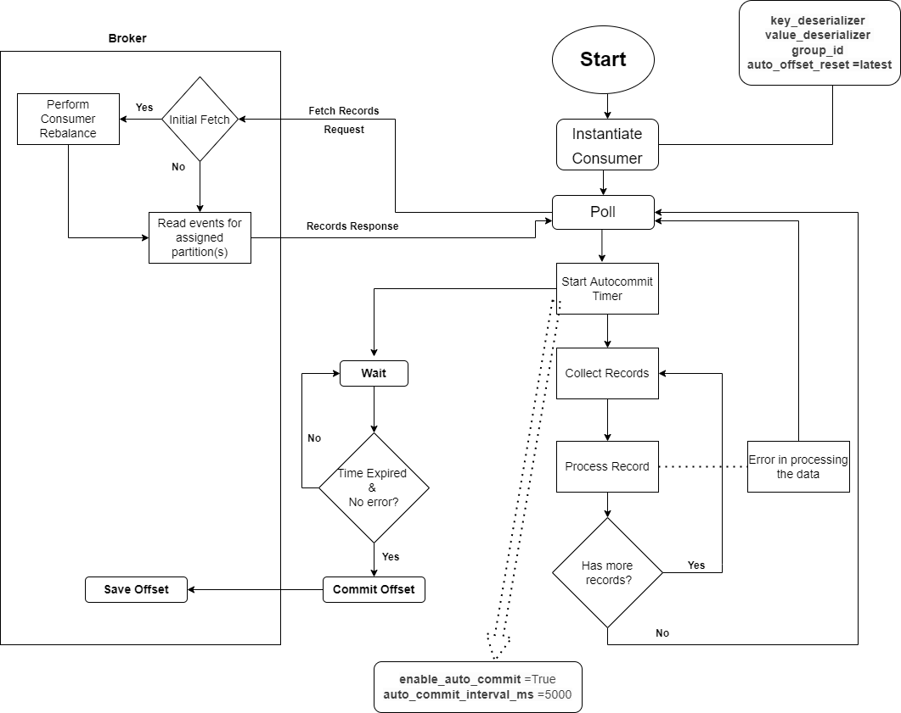
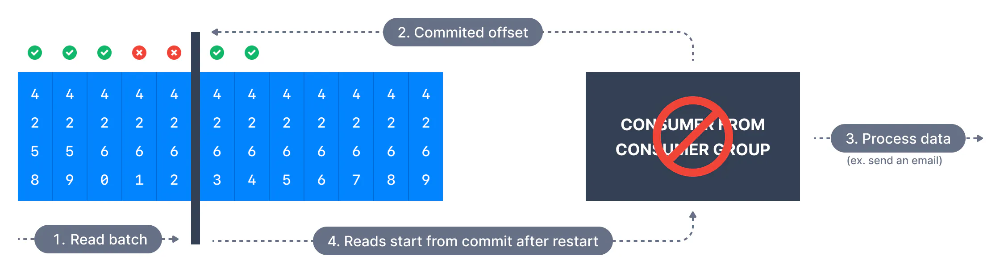
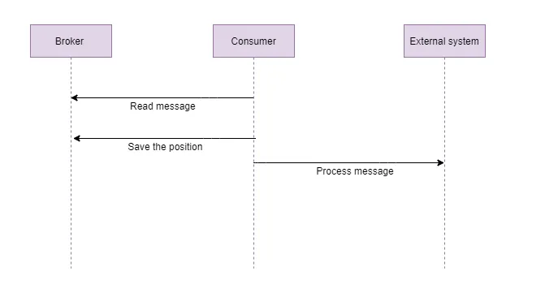
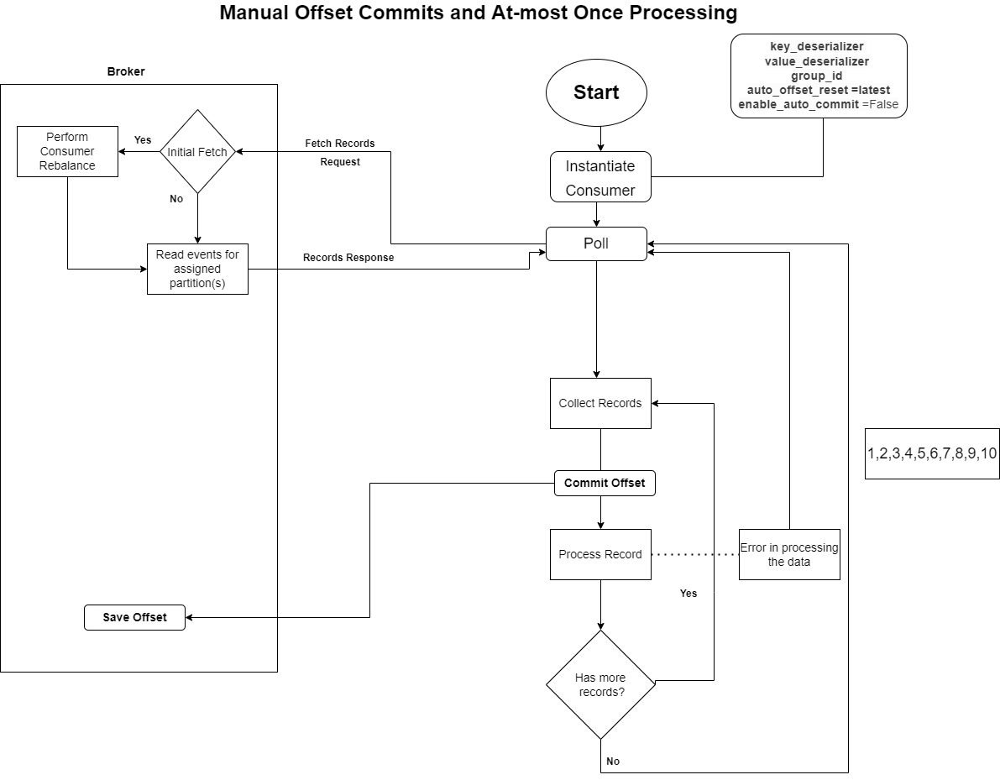
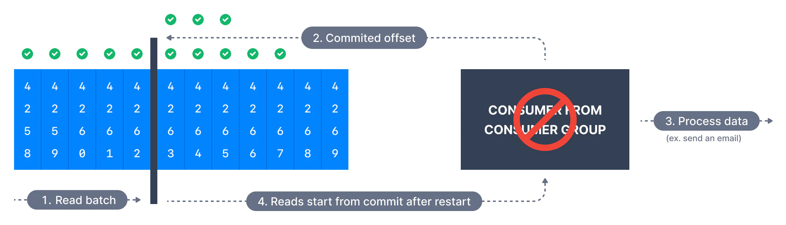
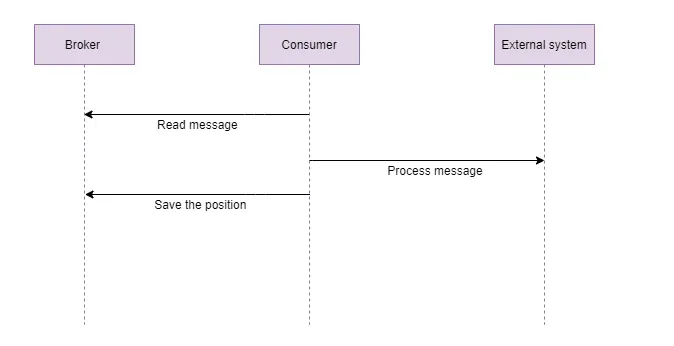
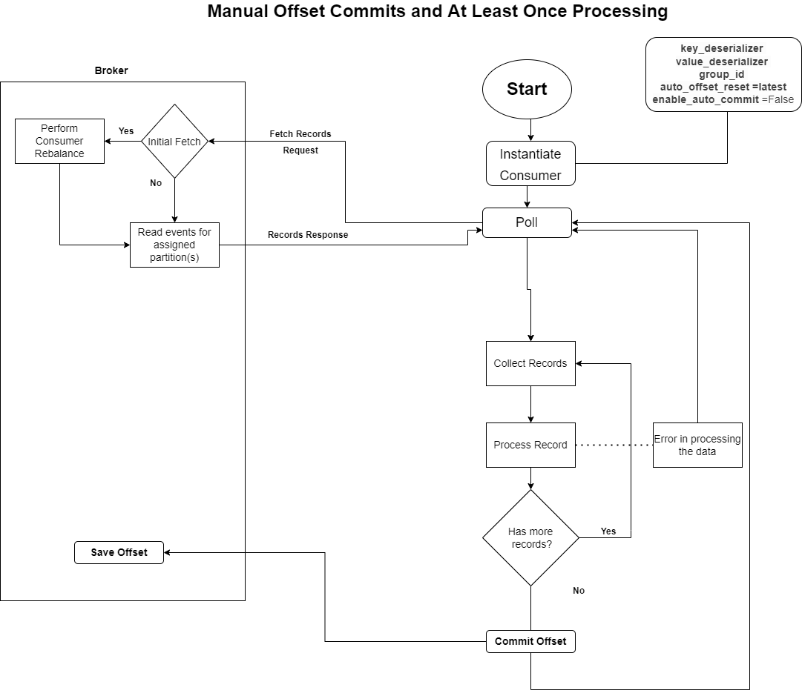
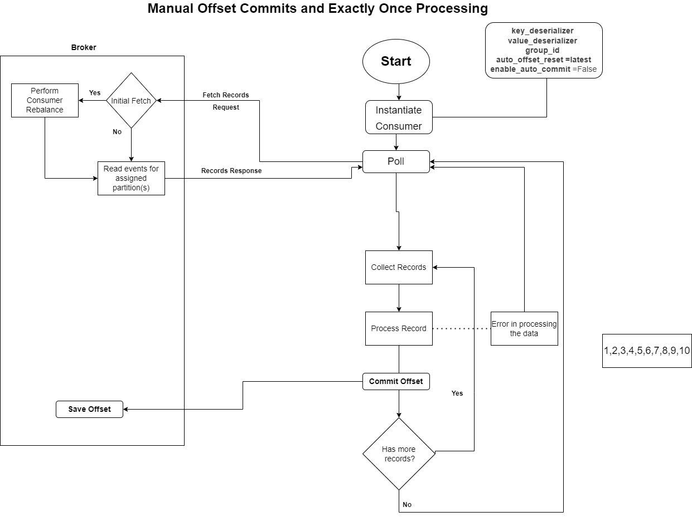

# In depth on Auto & Manual Offset Commits

## **```enable.auto.commit = true```**

In Apache Kafka, the enable.auto.commit configuration parameter determines whether the consumer's offset is automatically committed to the Kafka broker. This parameter works in conjunction with auto.commit.interval.ms, which specifies the interval at which offsets are committed. Let's explore how messages could be lost due to a large auto.commit.interval.ms and how messages could be processed twice with a small interval. Caution with auto commit : With auto commit enabled, kafka consumer client will always commit the last offset returned by the poll method even if they were not processed. For example, if poll returned messages with offsets 0 to 1000, and the consumer could process only up to 500 of them and crashed after auto commit interval. Next time when it resumes, it will see last commit offset as 1000, and will start from 1001. This way it ended up losing message offsets from 501 till 1000. Hence with auto commit, it is critical to make sure we process all offsets returned by the last poll method before calling it again. Sometimes auto commit could also lead to duplicate processing of messages in case consumer crashes before the next auto commit interval. Hence kafka consumer provides APIs for developers to take control in their hand when to commit offsets rather than relying on auto commit by setting enable.auto.commit to false which we will discuss next.



**Messages Lost with a Big Interval (```auto.commit.interval.ms``` set to a large interval):**

Consider a scenario where the enable.auto.commit is set to true, but the auto.commit.interval.ms is set to a large value, say 30 seconds. This means that the consumer will automatically commit its offsets to the Kafka broker every 30 seconds.

    enable.auto.commit=true
    auto.commit.interval.ms=30000 #30 seconds

Now, let's say the consumer receives a batch of messages and starts processing them. If the consumer crashes or shuts down before the 10-minute interval elapses, it won't have a chance to commit the offsets. As a result, the consumed messages' offsets won't be committed, and upon restarting, the consumer will start consuming from the last committed offset, messages processed during that time window will be reprocessed from the last committed offset, potentially causing duplication if the processing is not idempotent.

**Messages Processed Twice with a Small Interval (```auto.commit.interval.ms``` set to a small interval):**

Now, let's consider a scenario where the ```auto.commit.interval.ms``` is set to a very small value, like 100 milliseconds.

    enable.auto.commit=true
    auto.commit.interval.ms=100

In this case, the consumer commits its offsets to the Kafka broker every 100 milliseconds. If the consumer is processing messages in batches and takes longer than 100 milliseconds to complete the processing, there's a risk of committing the offset before the processing is finished. For example, if the consumer starts processing a batch of messages and the processing takes 150 milliseconds, the offset will be committed while some messages are still being processed. If the consumer then crashes or encounters an issue after the commit but before completing the processing, upon restart, it will start consuming from the last committed offset, skipping the messages that were processed but not committed.

To avoid these issues, it's crucial to carefully tune the auto.commit.interval.ms based on the expected processing time of messages and the desired trade-off between committing offsets frequently and avoiding message duplication.

## **```enable.auto.commit = false```**
**Delivery Semantics for Kafka Consumers**

A consumer reading from a Kafka partition may choose when to commit offsets. That strategy impacts the behaviors if messages are skipped or read twice upon a consumer restart.

**At Most Once Delivery**
In this case, offsets are committed as soon as a message batch is received after calling ```poll()```. If the subsequent processing fails, the message will be lost. It will not be read again as the offsets of those messages have been committed already. This may be suitable for systems that can afford to lose data.

The sequence of steps is illustrated below.







**At Least Once (usually preferred)**
In at-least-once delivery, every event from the source system will reach its destination, but sometimes retries will cause duplicates. Here, offsets are committed after the message is processed. If the processing goes wrong, the message will be read again. This can result in duplicate processing of messages. This is suitable for consumers that cannot afford any data loss.







**Exactly Once **
Some applications require not just at-least-once semantics (meaning no data loss), but also exactly-once semantics. Each message is delivered exactly once. This may be achieved in certain situations if Kafka and the consumer application cooperate to make exactly-once semantics happen.



This can only be achieved for Kafka topic to Kafka topic workflows using the transactions API. The Kafka Streams API simplifies the usage of that API and enables exactly once using the setting ```processing.guarantee=exactly.once```
For Kafka topic to External System workflows, to effectively achieve exactly once, you must use an idempotent consumer.

**Summary**

At most once: offsets are committed as soon as the message is received. If the processing goes wrong, the message will be lost (it won’t be read again).

At least once: offsets are committed after the message is processed. If the processing goes wrong, the message will be read again. This can result in duplicate processing of messages. Make sure your processing is idempotent (i.e. processing again the messages won’t impact your systems)

Exactly once: Can be achieved for Kafka => Kafka workflows using high-level Kafka Streams API, or the lower level Kafka Transactions API. For Kafka => Sink workflows, use an idempotent consumer.

Bottom Line
For most applications you should use 'At Least Once' processing and ensure your transformations / processing are idempotent.

When ```enable.auto.commit``` is set to false, the consumer must manually commit offsets using the ```commitSync()``` or ```commitAsync()``` method. This provides more control to the application in terms of when to commit offsets, allowing for customized logic based on the processing of messages.