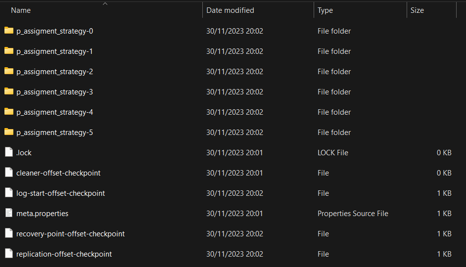
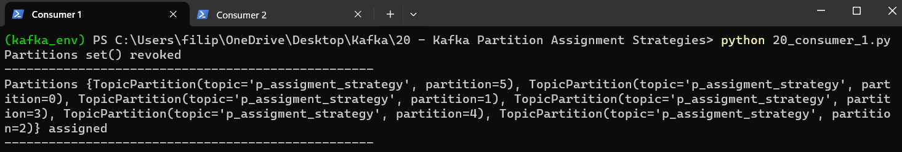
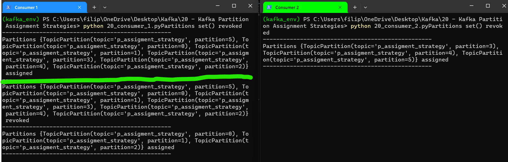
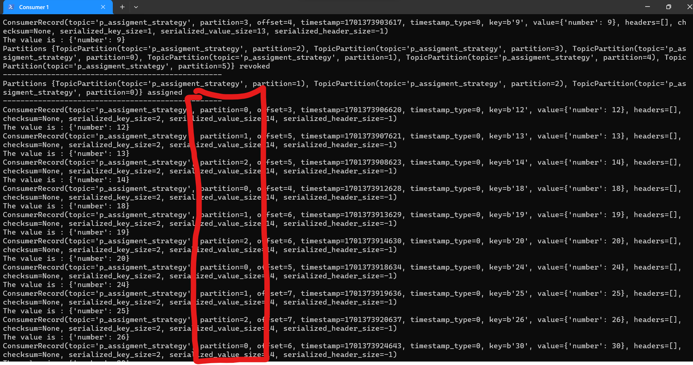
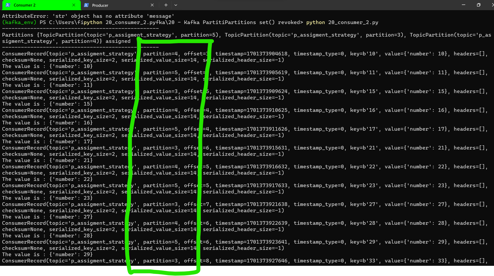
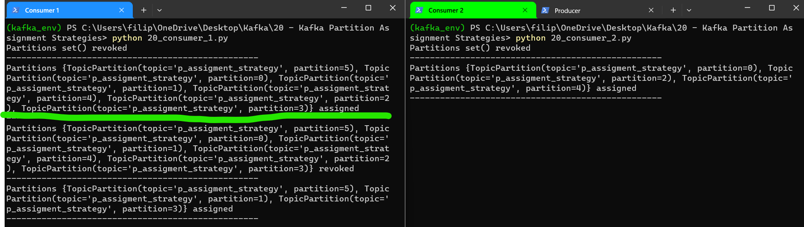

# Kafka Partition Assignment Strategies

When a new consumer group is created a consumer group coordinator is elected. The coordinator lives on a broker assigned by a hash() of the consumer group name. This coordinator is responsible for various tasks, including partition assignment, offset commits, and deciding when a consumer should be marked “failed”. Consumers in a consumer group share ownership of the partitions in the topics they subscribe to. When we add a new consumer to the group, it starts consuming messages from partitions previously consumed by another consumer. The same thing happens when a consumer shuts down or crashes; it leaves the group, and the partitions it used to consume will be consumed by one of the remaining consumers.

Reassignment of partitions to consumers also happens when the topics the consumer group is consuming are modified, e.g. new partitions are added to the topic.

PartitionAssignor is the class that decides which partitions will be assigned to which consumer. When creating a new Kafka consumer, we can configure the strategy that will be used to assign the partitions amongst the consumers. We can set it using the configuration ```partition.assignment.strategy```. All the Kafka consumers which belong to the same consumer group must have a single assignment strategy. If a consumer attempts to join a consumer group that has a different assignment strategy, it will end up getting an ```InconsistentGroupProtocolException```.

By default, Kafka has the following assignment strategies.

## RangeAssignor

Concept:

Idea: Assigning partitions based on a defined range.
How it works: Each consumer is assigned a specific range of partitions.

Example:

If you have 3 consumers (C1, C2, C3) and 12 partitions (P1, P2, P3, P4, P5, P6, P7, P8, P9, P10, P11, P12):
Each consumer gets a range of 4 partitions based on predefined ranges.

Schema:

'''
| Consumer   | Partitions Assigned  |
|------------|----------------------|
| C1         | P1, P2, P3, P4       |
| C2         | P5, P6, P7, P8       |
| C3         | P9, P10, P11, P12    |

'''

## RoundRobinAssignor

Concept:

Idea: Distributing partitions equally among available consumers.
How it works: Each consumer gets assigned partitions in a circular, sequential fashion.

Example:

If you have 3 consumers (C1, C2, C3) and 12 partitions (P1, P2, P3, P4, P5, P6, P7, P8, P9, P10, P11, P12):
Each consumer gets 4 partitions in a circular, sequential fashion.
Next assignment repeats the sequence.

Schema:

'''
| Consumer   | Partitions Assigned  |
|------------|----------------------|
| C1         | P1, P4, P7, P10      |
| C2         | P2, P5, P8, P11      |
| C3         | P3, P6, P9, P12       |
'''

# Practical examples

** Range Assignor**

Start Kafka Zookeeper:

'''
kafka_2.12-3.6.0\bin\windows\zookeeper-server-start.bat  kafka_2.12-3.6.0\config\zookeeper.properties
'''

Start Kafka Broker (Server):

'''
kafka_2.12-3.6.0\bin\windows\kafka-server-start.bat kafka_2.12-3.6.0\config\server.properties 
'''

Create Topic:

'''
kafka_2.12-3.6.0/bin/windows/kafka-topics.bat --create --topic p_assigment_strategy --bootstrap-server localhost:9092 --replication-factor 1 --partitions 6
'''

If you go to your Kafka log directory you can see those 6 partitions created:



Our producer code in 20_producer.py :

```python
from time import sleep
from json import dumps
from kafka import KafkaProducer

def custom_partitioner(key, all_partitions, available):
    """
    Custom Kafka partitioner to get the partition corresponding to key
    :param key: partitioning key
    :param all_partitions: list of all partitions sorted by partition ID
    :param available: list of available partitions in no particular order
    :return: one of the values from all_partitions or available
    """
    print("The key is :{}".format(key))
    print("All partitions : {}".format(all_partitions))
    print("After decoding of the key : {}".format(key.decode('UTF-8')))
    return int(key.decode('UTF-8'))%len(all_partitions)

topic_name = "p_assigment_strategy"
producer = KafkaProducer(bootstrap_servers=['localhost:9092'], value_serializer= lambda x: dumps(x).encode('UTF-8'), partitioner=custom_partitioner)

for e in range (1,100):
    data = {'number': e}
    producer.send(topic_name,key=str(e).encode(),value=data)
    sleep(1)
```

Our consumer logic in a 20_consumer.py :

```python
from kafka.coordinator.assignors.range import RangePartitionAssignor
#from kafka.coordinator.assignors.raoundrobin import RoundRobinPartitionAssignor

from kafka import KafkaConsumer
from kafka import TopicPartition, OffsetAndMetadata
import kafka
import json

class MyConsumerRebalanceListener(kafka.ConsumerRebalanceListener):

    def on_partitions_revoked(self, revoked):
        print('Partitions %s revoked' % revoked)
        print('-' * 50)

    def on_partitions_assigned (seld, assigned):
        print('Partitions %s assigned' % assigned)
        print('-' * 50)

consumer = KafkaConsumer (bootstrap_servers=['localhost:9092'], value_deserializer= lambda m: json.loads(m.decode('utf-8')), group_id = 'demo_1', auto_offset_reset ='earliest', enable_auto_commit = False, partition_assignment_strategy = [RangePartitionAssignor])

listener = MyConsumerRebalanceListener()
consumer.subscribe('p_assigment_strategy', listener = listener)

for message in consumer:
    print(message)
    print("The value is : {}".format(message.value))
    tp=TopicPartition(message.topic,message.partition)
    om = OffsetAndMetadata(message.offset+1, message.timestamp)
    consumer.commit({tp:om})

```

Now create 2 consumers with same code and belonging to the same Consumer Group, and start them( firstly start one consumer, observe, then start second consumer, observe) without starting producer.



We can see that initially, when only one consumer is started, all the partitions are assigned to that consumer (partitions 0-5)
Now, let's start another consumer and let's see if partitions get reassigned based on RangePartitioner or not.
Firstly, we can see that all partitions get revoked. Then, Kafka can see that two consumers are running and will distribute certain partitions to each of the consumers. (green line represents point in time where consumer 2 gets started)



We can see that:
Consumer 1 gets assigned P0, P1 and P2
Consumer 2 gets assigne P3, P4 and P5

To conclude, we can confirm that partitions are assigned to each consumer in Consumer Group based on Range Partitioning Strategy

Now, we can start producer to observe above in action:


Consumer 1 is getting only messages from partitions 0, 1 and 2 respectively.

Consumer 2 is getting only messages from partitions 3, 4 and 5 respectively.



Now comment out --> ```#from kafka.coordinator.assignors.range import RangePartitionAssignor``` and uncomment ```from kafka.coordinator.assignors.raoundrobin import RoundRobinPartitionAssignor```. See what happens:



