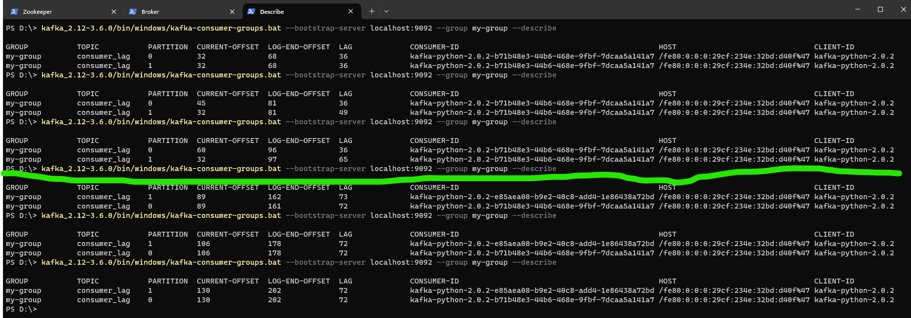

# Consumer Lag Analysis

**Kafka Consumer Lag** is the difference between the last offset stored by the broker and the last committed offset for that partition.

Kafka consumer lag can occur for a variety of reasons. Some common causes of consumer lag include:

1. **Insufficient consumer capacity**: If the consumer is not able to keep up with the rate at which new messages are being produced and added to the topic, it will fall behind and the consumer lag will increase.

2. **Slow consumer processing**: If the consumer code is inefficient or takes a long time to process each message, it may cause the consumer to fall behind and increase the consumer lag.

3. **High rate of message production**: If the rate at which messages are being produced and added to the topic is very high, it can be difficult for the consumer to keep up, resulting in consumer lag.

To avoid consumer lag, you can take the following steps:

1. **Monitor consumer lags regularly**: By using tools like the Kafka Consumer Offset Checker, you can regularly check the consumer lag and identify any issues before they become a problem. Consumer lag is typically monitored at the consumer group level.

2. **Increase consumer capacity**: If the consumer is falling behind due to insufficient capacity, you can increase the number of consumers or optimize the consumer code to process messages more efficiently.

3. **Optimize consumer processing**: If the consumer code is inefficient or takes a long time to process each message, you can optimize the code to improve performance and reduce consumer lag.

4. **Throttle message production**: If the rate at which messages are being produced is too high, you can use techniques like rate limiting or backpressure to slow down the rate of message production and give the consumer time to catch up.

Lets see Consume Lag in experiment

Start Kafka Zookeeper:
'''
kafka_2.12-3.6.0\bin\windows\zookeeper-server-start.bat  kafka_2.12-3.6.0\config\zookeeper.properties
'''

Start Broker (Server):
'''
kafka_2.12-3.6.0\bin\windows\kafka-server-start.bat kafka_2.12-3.6.0\config\server.properties 
'''

Create Topic:
'''
kafka_2.12-3.6.0/bin/windows/kafka-topics.bat --create --topic consumer_lag --bootstrap-server localhost:9092 --replication-factor 1 --partitions 2
'''

Our producer code in 21_consumer_lag_producer.py:

```python
from time import sleep
from json import dumps
from kafka import KafkaProducer

def custom_partitioner(key, all_partitions, available):
    """
    Custom Kafka partitioner to get the partition corresponding to key
    :param key: partitioning key
    :param all_partitions: list of all partitions sorted by partition ID
    :param available: list of available partitions in no particular order
    :return: one of the values from all_partitions or available
    """
    print("The key is :{}".format(key))
    print("All partitions : {}".format(all_partitions))
    print("After decoding of the key : {}".format(key.decode('UTF-8')))
    return int(key.decode('UTF-8'))%len(all_partitions)

topic_name = "consumer_group"
producer = KafkaProducer(bootstrap_servers=['localhost:9092'], value_serializer= lambda x: dumps(x).encode('UTF-8'), partitioner=custom_partitioner)

for e in range (1,1000):
    data = {'number': e}
    producer.send(topic_name,key=str(e).encode(),value=data)
    sleep(0.4)
```

Our consumer in 21_consumer_lag_consumer.py:
```python
from kafka import KafkaConsumer
from kafka import TopicPartition, OffsetAndMetadata
import kafka
import json


consumer = KafkaConsumer (bootstrap_servers=['localhost:9092'], value_deserializer= lambda m: json.loads(m.decode('utf-8')), group_id = 'my-group', auto_offset_reset ='earliest', enable_auto_commit = False)

for message in consumer:
    print(message)
    tp=TopicPartition(message.topic,message.partition)
    om = OffsetAndMetadata(message.offset+1, message.timestamp)
    consumer.commit({tp:om})
    sleep(0.8)

```

We can notice that lag would come from intentionally written difference in producer sleep (0.4) and consumers sleep(0.8). Our assumption is that consumer will keep on adding (accumulating) more and more consumer lag.
Now, run this command in your CLI to understand how much lag is happening:
'''
kafka_2.12-3.6.0/bin/windows/kafka-consumer-groups.bat --bootstrap-server localhost:9092 --topic consumer_lag --group my-group --describe
'''

After some time (represented with green line on the picture below ) we started our second consumer. What we can see now is that our lag is not increasing anymore but is constant.

