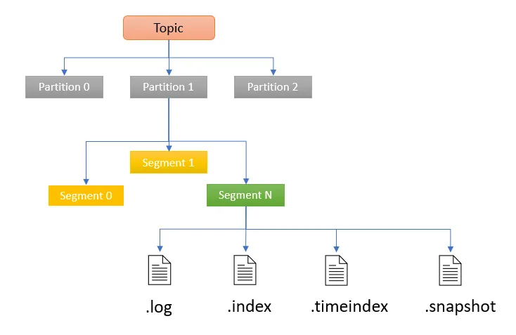
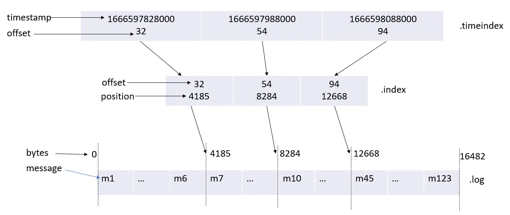

# .index and .timeindex

Storage structure file schema looks like this:



The ```.log ``` file is an actual segment containing records up to a specific offset. The name of the file defines the starting offset of the records in that log.

The ```.index``` file contains an index that maps a logical offset (in effect the record’s id) to the byte offset of the record within the .log file. It is used for accessing records at specified offsets in the log without having to scan the whole ```.log``` file. It helps Kafka know what part of a segment to read to find a message.

The ```.timeindex``` file is another index used for accessing records by timestamp in the log.



