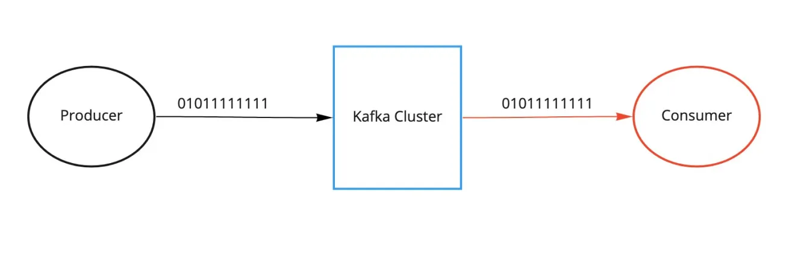
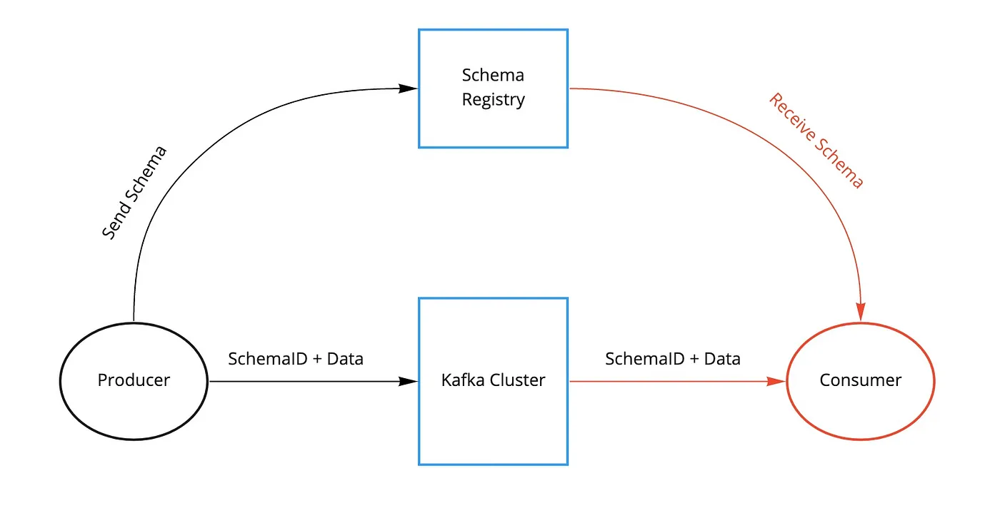
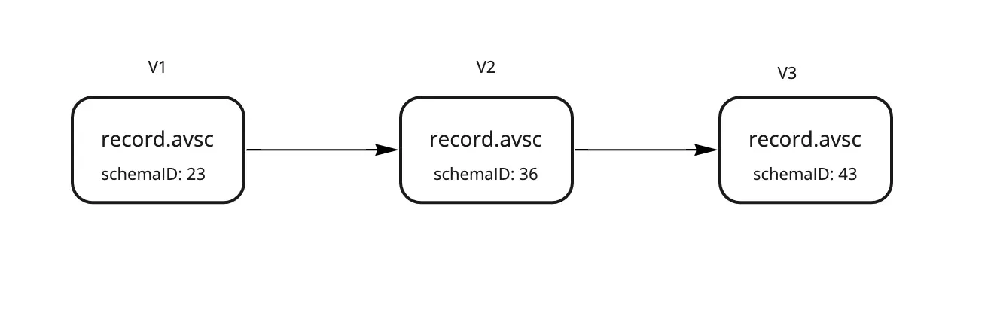
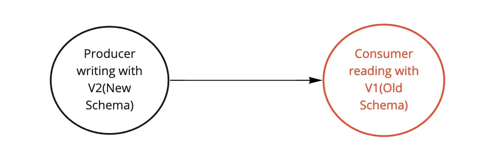
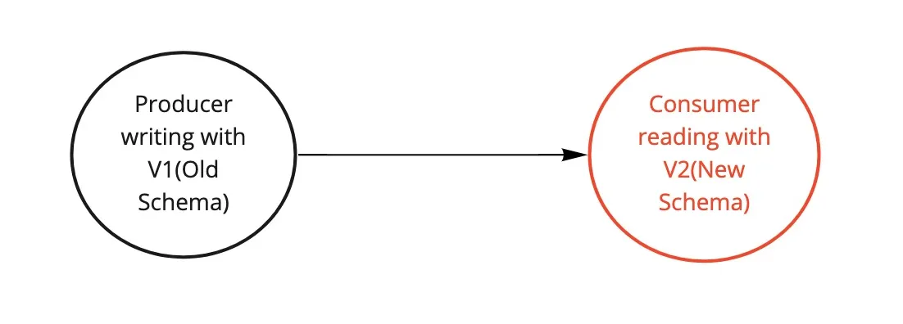

# Schema Registry 

Kafka, at its core, only transfers data in byte format. There is no data verification that’s being done at the Kafka cluster level. In fact, Kafka doesn’t even know what kind of data it is sending or receiving; whether it is a string or integer.



Due to the decoupled nature of Kafka, producers and consumers do not communicate with each other directly, but rather information transfer happens via Kafka topic. At the same time, the consumer still needs to know the type of data the producer is sending in order to deserialize it. Imagine if the producer starts sending bad data to Kafka or if the data type of your data gets changed. Your downstream consumers will start breaking. We need a way to have a common data type that must be agreed upon.

That’s where Schema Registry comes into the picture. It is an application that resides outside of your Kafka cluster and handles the distribution of schemas to the producer and consumer by storing a copy of schema in its local cache.



With the schema registry in place, the producer, before sending the data to Kafka, talks to the schema registry first and checks if the schema is available. If it doesn’t find the schema then it registers and caches it in the schema registry. Once the producer gets the schema, it will serialize the data with the schema and send it to Kafka in binary format prepended with a unique schema ID. When the consumer processes this message, it will communicate with the schema registry using the schema ID it got from the producer and deserialize it using the same schema. If there is a schema mismatch, the schema registry will throw an error letting the producer know that it’s breaking the schema agreement.

**AVRO Data Serialization Format**
Avro is a binary serialization format developed within the Apache Hadoop project. It's often used for efficient data serialization and is designed to be compact, fast, and suitable for serializing large amounts of data. Avro is primarily used for serializing data structures to be exchanged between processes written in different languages. It facilitates the storage and exchange of complex data structures efficiently. Avro supports schema evolution, allowing you to change the schema without breaking compatibility with existing data. This is particularly useful in environments where data schemas may evolve over time. Avro's binary format is compact, leading to better performance compared to some other serialization formats. It is well-suited for use in big data processing frameworks, such as Apache Hadoop. Avro requires data to be serialized along with its schema. The schema is defined in JSON format, making it human-readable and easy to understand. The schema is used to validate the data during serialization and deserialization.
The Avro schema is typically defined in a JSON document with a .avsc file extension. It describes the structure of the data, including field names, data types, and optional metadata.

Here is an example of AVRO:

```json
{
  "type" : "record",
  "name" : "User",
  "namespace" : "com.example.models.avro",
  "fields" : [ 
   {"name" : "userID", "type" : "string", "doc" : "User ID of a web app"}, 
   {"name" : "customerName", "type" : "string", "doc" : "Customer Name", "default": "Test User"} 
  ]
}
```

**Schema Evolution**

With time, our AVRO schemas will evolve. We will add new fields or update existing fields. With evolving schemas, our downstream consumers should be able to consume messages seamlessly without sending a production alert at 3 AM. Schema Registry is specifically built for data evolution by versioning each schema change.



When a schema is first created, it gets a unique schema ID and a version number. With time, our schemas will evolve, we add new changes and if changes are compatible, we get a new schema ID and our version number increments.

There are various patterns for schema evolution:

**Forward Compatibility**: update producer to V2 version of the schema and gradually update consumers to the V2 version. Forward compatibility is the ability of consumers to understand and process messages produced with an older schema version than the one they are aware of. It enables consumers with a newer schema to handle messages produced with an older schema.



**Backward Compatibility**: update all consumers to the V2 version of the schema and then update producer to V2 version. Backward compatibility refers to the ability of consumers to process messages that were produced with a newer schema version than the one they are aware of. In other words, it allows consumers with an older schema to still understand and consume messages produced with a newer schema.



**Full Compatibility**: when schemas are both forward and backward compatible.


Schema Registry is a simple concept but it’s really powerful in enforcing data governance within your Kafka architecture. Schemas reside outside of your Kafka cluster, only the schema ID resides in your Kafka, hence making schema registry a critical component of your infrastructure. If the schema registry is not available, it will break producers and consumers. So it is always a best practice to ensure your schema registry is highly available.