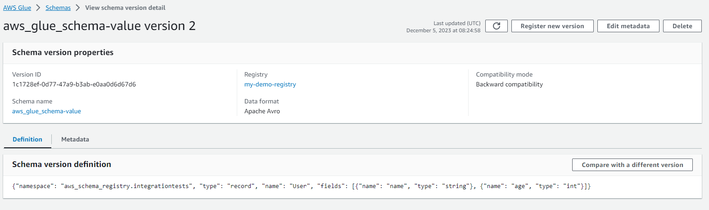

AWS Glue is a fully managed extract, transform, and load (ETL) service that makes it easy to prepare and load data for analysis. It supports various data sources and destinations, including data lakes, data warehouses, and databases. In the context of a schema registry for local Kafka clusters and AWS Managed Streaming for Apache Kafka (MSK), AWS Glue can be used to streamline the process of ingesting, transforming, and loading data.

**Schema Registry for Local Kafka Cluster:**
Data Catalog and Schema Evolution:

AWS Glue Data Catalog is a central repository that stores metadata about data sources. For a local Kafka cluster, you can use AWS Glue to catalog your Kafka topics and schemas.
Schema evolution is supported, allowing you to handle changes to the schema over time without disrupting data processing.
Schema Inference and Discovery:

AWS Glue can automatically infer the schema of your data, making it easier to work with diverse data sources, including Kafka topics.
Data Preparation and Transformation:

AWS Glue supports data transformation using Apache Spark ETL jobs. You can use it to clean, enrich, and transform data before loading it into your data lake or warehouse.
Job Scheduling and Automation:

Schedule AWS Glue jobs to run at specific intervals or trigger them based on events. This automation ensures that your data processing pipeline is regularly and reliably executed.
Schema Registry for AWS MSK:

**Integration with AWS MSK:**

AWS Glue can be integrated with AWS MSK to ingest, transform, and load streaming data from Kafka topics into various AWS services.
Schema Evolution and Compatibility:

As with the local Kafka cluster, AWS Glue supports schema evolution when working with AWS MSK. It helps manage changes to the schema over time and ensures compatibility.
Monitoring and Logging:

AWS Glue provides monitoring and logging features, allowing you to track the performance of your ETL jobs and troubleshoot issues. This is essential for maintaining a reliable data pipeline.
Security and Access Control:

AWS Glue integrates with AWS Identity and Access Management (IAM), providing fine-grained access control to your data and ETL processes.
Scalability:

AWS Glue is designed to scale horizontally to handle large volumes of data. This is particularly important when dealing with streaming data from Kafka topics.
In summary, AWS Glue simplifies the process of working with Kafka data, whether it's from a local Kafka cluster or AWS MSK, by providing a managed ETL service, schema management, and automation capabilities. It allows you to build robust data processing pipelines for both batch and streaming data scenarios.

**EXAMPLE**
Go to your AWS Console and click on AWS Glue service icon:


On the left hand side menu click on *Stream schema registries* where we can create registry first:


Create new registry by clicking on *Add registry* button and give it a name :


In your schema registries list you can now find your newly created registry with some info:


For the connection between our local Kafka cluster and AWS Glue Schema Registry we will use ```aws-glue-schema-registry``` module by installing it with ```pip install aws-glue-schema-registry``` into our virtual environment. Also you will need to ```pip install boto3``` which is AWS SDK for python.

First use *boto3* to create a low-level AWS Glue client:

```python
import boto3

# Pass your AWS credentials or profile information here
session = boto3.Session(access_key_id=YOUR_ACCESS_KEY, secret_access_key=YOUR_SECRET_KEY, region_name='us-east-1')

glue_client = session.client('glue')
```

Send Kafka messages with ```SchemaRegistrySerializer``` (producer):

```python
from aws_schema_registry import DataAndSchema, SchemaRegistryClient
from aws_schema_registry.avro import AvroSchema

# In this example we will use kafka-python as our Kafka client,
# so we need to have the `kafka-python` extras installed and use
# the kafka adapter.
from aws_schema_registry.adapter.kafka import KafkaSerializer
from kafka import KafkaConsumer

# Create the schema registry client, which is a façade around the boto3 glue client
client = SchemaRegistryClient(glue_client, registry_name='my-demo-registry')

# Create the serializer
serializer = KafkaSerializer(client)

# Create the producer
producer = KafkaProducer(value_serializer=serializer)

# Our producer needs a schema to send along with the data.
# In this example we're using Avro, so we'll load an .avsc file.
with open('user.avsc', 'r') as schema_file:
    schema = AvroSchema(schema_file.read())

# Send message data along with schema
data = {
    'name': 'John Doe',
    'age': 6 ,
    'subject': 'something'
}
record_metadata=producer.send('aws_glue_schema', value=(data, schema)).get(timeout=10)
# the value MUST be a tuple when we're using the KafkaSerializer

print(record_metadata.topic)
print(record_metadata.partition)
print(record_metadata.offset)
```
When you go into your created AWS Glue registry you can not find any schemas yet.


But our AVRO Serializer should register schema when sending data record for the first time.

So now lets run our Kafka cluster.

Start Kafka Zookeeper:
'''
kafka_2.12-3.6.0\bin\windows\zookeeper-server-start.bat  kafka_2.12-3.6.0\config\zookeeper.properties
'''

Start Broker (Server):
'''
kafka_2.12-3.6.0\bin\windows\kafka-server-start.bat kafka_2.12-3.6.0\config\server.properties 
'''

Create Topic:
'''
kafka_2.12-3.6.0/bin/windows/kafka-topics.bat --create --topic aws_glue_schema --bootstrap-server localhost:9092 --replication-factor 1 --partitions 1
'''

Run our producer script producer.py:
```python producer.py```


Our record got succesfully produced into topic *'aws_glue_schema'* , partition 0 (only partition), and offset 0 (first message).

If we now go into our *'my-demo-registry'* in our AWS Glue console we can now find that our first schema got registrated. Registered schema name will always be the same as our topic name, to avoid any confusion :


Whenever we try to produce some message with our producer it should have those 3 fields (name, age, subject), otherwise message would not get published. We will try to publishe this data record now with our producer.py to see what happens:

```python
data = {
    'name': 'John Doe',
    'age': 6 ,
}

# we are missing subject field now
```


Lets now try different kind of error, when we are passing all subject but one of them is wrong data type:

```python
data = {
    'name': 'John Doe',
    'age': 'string' ,
    'subject': 'something'
}
```
This is the result:


The bad data is not getting published into our Kafka Cluster!

Read Kafka messages with ```SchemaRegistryDeserializer``` (consumer):

```python
import os
import boto3
from dotenv import load_dotenv

# In this example we will use kafka-python as our Kafka client,
# so we need to have the `kafka-python` extras installed and use
# the kafka adapter.
from aws_schema_registry import SchemaRegistryClient
from aws_schema_registry.adapter.kafka import KafkaDeserializer
from aws_schema_registry import DataAndSchema, SchemaRegistryClient
from kafka import KafkaConsumer

# Load environment variables from .env file
load_dotenv()

# Access environment variables
access_key = os.getenv("AWS_ACCESS_KEY")
secret_key = os.getenv("AWS_SECRET_KEY")

# Pass your AWS credentials or profile information here
session = boto3.Session(aws_access_key_id=access_key, aws_secret_access_key=secret_key, region_name='us-east-1')

glue_client = session.client('glue')

# Create the schema registry client, which is a façade around the boto3 glue client
client = SchemaRegistryClient(glue_client, registry_name='my-demo-registry')

# Create the deserializer
deserializer = KafkaDeserializer(client)

# Create the consumer
consumer = KafkaConsumer(bootstrap_servers=['localhost:9092'], value_deserializer=deserializer,auto_offset_reset ='earliest')
consumer.subscribe('aws_glue_schema')

# Now use the consumer normally
for message in consumer:
    # The deserializer produces DataAndSchema instances
    value: DataAndSchema = message.value
    # which are NamedTuples with a `data` and `schema` property
    value.data == value[0]
    value.schema == value[1]
    # and can be deconstructed
    data, schema = value
    
    print (value)
```


Only first message got published because it was correct schema structure.

Lets now update our schema by deleting 'subject' field in our ```user.avsc``` (backward compatibility) and publish message record with this data:

```python
data = {
    'name': 'John Doe',
    'age': 30 ,
}
```


Our record got published even though we missed 'subject' field. Why? Because our schema got updated version when we changed our .avsc file. That, we can also see in our AWS Glue Schema Registry console:




What if we now try to update schema again by adding one field (which would be a case of forward compatibility), lets see that. 
user.avsc:

```
{
	"namespace":"aws_schema_registry.integrationtests",
	"type":"record",
	"name":"User",
	"fields": [
		{"name":"name", "type":"string"},
		{"name":"age", "type":"int"},
		{"name":"height", "type":"int"}
	]
}
```
Data to publish:

```python
data = {
    'name': 'John Doe',
    'age': 30 ,
    'height': 190
}
```


We tried to register our updated schema version but it failed because our schema is not forward compatibile:

