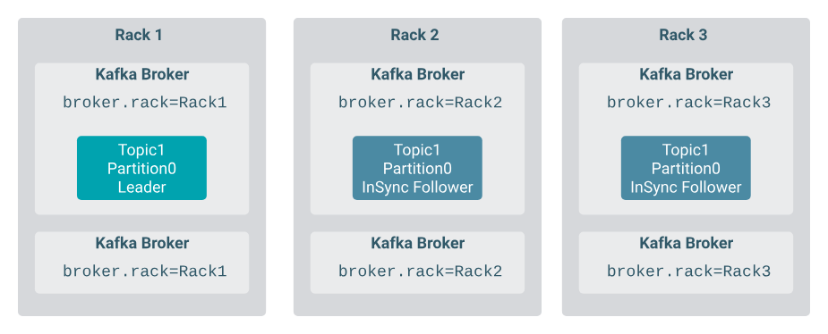
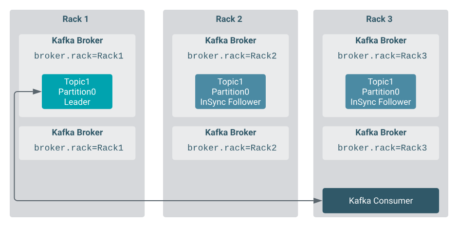
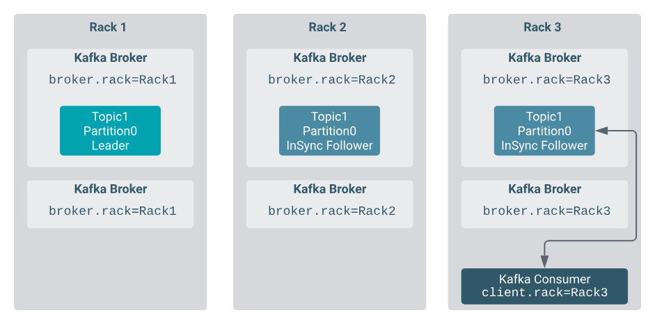

# Kafka Rack Awareness

Racks provide information about the physical location of a broker or a client. A Kafka deployment can be made rack aware by configuring rack awareness for the Kafka brokers and clients respectively. Enabling rack awareness can help in hardening your deployment, it provides durability guarantees for your Kafka service, and significantly decreases the chances of data loss.

## Rack Awareness for Brokers

To avoid a single point of failure, instead of putting all brokers into the same rack, it is considered a best practice to spread your Kafka brokers among racks. In cloud environments Kafka brokers located in different availability zones or data centers are usually deployed in different racks. Kafka brokers have built in support for this type of cluster topology and can be configured to be aware of the racks they are in.

If you create, modify, or redistribute a topic in a rack-aware Kafka deployment, rack awareness ensures that replicas of the same partition are spread across as many racks as possible. This limits the risk of data loss if a complete rack fails. Replica assignment will try to assign an equal number of leaders for each broker, therefore, it is advised to configure an equal number of brokers for each rack to avoid uneven load of racks.

For example, assume you have a topic partition with 3 replicas and have the brokers configured in 3 different racks. If rack awareness is enabled, Kafka will try to distribute the replicas among the racks evenly in a round-robin fashion. In the case of this example, this means that Kafka will ensure to spread all replicas among the 3 different racks, significantly decreasing the chances of data loss in case of a rack failure.

## Rack Awareness for Consumers

When a Kafka consumer tries to consume a topic partition, it fetches from the partition leader by default. If the partition leader and the consumer are not in the same rack, fetching generates significant cross-rack traffic, which has a number of disadvantages. For example, it can generate high costs and lead to lower consumer bandwidth and throughput.

For this reason, it is possible to provide the client with rack information so that the client fetches from the closest replica instead of the leader. If the configured closest replica does not exist (there is no replica for the needed partition in the configured closest rack), it uses the partition leader. This feature is called follower fetching and it can be used to mitigate the costs generated by cross-rack traffic or increase consumer throughput.

## Rack Awareness for Producers

Compared to brokers or consumers, there are no producer specific rack-awareness features or toggles that you can enable. However, in a deployment where rack awareness is an important factor, you can make configuration changes so that producers make use of rack awareness and have messages replicated to multiple racks.

__Example__

Start Kafka Zookeeper and 3 servers (brokers) with following commands:

    /kafka_2.12-3.6.0/bin/windows/zookeeper-server-start.bat  D:/kafka_2.12-3.6.0/config/zookeeper.properties
    /kafka_2.12-3.6.0/bin/windows/kafka-server-start.bat D:/kafka_2.12-3.6.0/config/server1.properties
    /kafka_2.12-3.6.0/bin/windows/kafka-server-start.bat D:/kafka_2.12-3.6.0/config/server2.properties
    /kafka_2.12-3.6.0/bin/windows/kafka-server-start.bat D:/kafka_2.12-3.6.0/config/server3.properties

Check for broker ids with:

    /kafka_2.12-3.6.0/bin/windows/zookeeper-shell.bat localhost:2181 ls /brokers/ids

,and you will get:

    Connecting to localhost:2181

    WATCHER::

    WatchedEvent state:SyncConnected type:None path:null
    [0, 1, 2]

So, we can see that we have 3 Kafka servers (brokers) with ids 0, 1 and 2.

Create topic with:

    /kafka_2.12-3.6.0/bin/windows/kafka-topics.bat --create --topic demo-test --bootstrap-server localhost:9092, localhost:9093, localhost:9094 --replication-factor 2 --partitions 1

and check *describe* table:

    /kafka_2.12-3.6.0/bin/windows/kafka-topics.bat --bootstrap-server localhost:9092, localhost:9093, localhost:9094 --describe --topic demo-test

Which will give you output like this:

    Topic: demo-test        TopicId: zHWRvgI4QgyC2kT_a7arQw PartitionCount: 1       ReplicationFactor: 2    Configs:
        Topic: demo-test        Partition: 0    Leader: 2       Replicas: 2,1   Isr: 2,1

Now, we can see that we have 1 partition with whose leader is server 3 (broker id = 2), and replica is also stored in server in server 2 ( broker id = 1). But what if server 2 and 3 are both phisically in the same location. Without rack awareness, there is a higher risk of data loss in the event of rack-level failures. If all replicas of a topic or partition happen to be placed in the same rack, the failure of that rack could result in the permanent loss of data. This lack of redundancy can be a significant problem for ensuring data durability.

Configuring rack settings for each Kafka broker involves specifying the rack information in the broker's configuration. This allows Kafka to distribute replicas of topics and partitions across different racks, ensuring fault tolerance and high availability. To configure rack settings for each broker:

1. Identify Racks: First, you need to identify the racks or physical locations where your Kafka brokers are located. Each rack should have a unique identifier. This information is typically provided by your data center or cloud infrastructure.

2. Update Broker Configuration: Modify the server.properties configuration file for each Kafka broker to include the broker.rack property. You can specify the rack for each broker in this property. For example:

        broker.rack=1 (for brokers 1 and 2) and broker.rack=2 (for broker 0)

3. Restart Brokers: After updating the server.properties file with the rack information, you'll need to restart the Kafka brokers to apply the changes. Depending on your Kafka deployment, you can restart the Kafka service or the individual brokers.

4. Create new topic:

        /kafka_2.12-3.6.0/bin/windows/kafka-topics.bat --create --topic demo-test2 --bootstrap-server localhost:9092, localhost:9093, localhost:9094 --replication-factor 2 --partitions 1

5. Data Replication: Kafka will now use the rack information to ensure that replicas of topics and partitions are distributed across different racks. Replicas will be placed in a way that minimizes the risk of data loss in the event of rack-level failures.

6. Verify Configuration: You can use Kafka tools, such as the kafka-topics command, to verify that replicas are distributed across racks as expected. For example, you can use the following command to describe the distribution of replicas for a specific topic:

        /kafka_2.12-3.6.0/bin/windows/kafka-topics.bat --bootstrap-server localhost:9092, localhost:9093, localhost:9094 --describe --topic demo-test2

Output of above command:

        Topic: demo-test2       TopicId: 772RW9a1RrGBLeFtN41PIg PartitionCount: 1       ReplicationFactor: 2    Configs:
        Topic: demo-test2       Partition: 0    Leader: 0       Replicas: 0,2   Isr: 0,2

We can clearly see that Kafka distributed replicas among brokers which are not in the same rack.

    