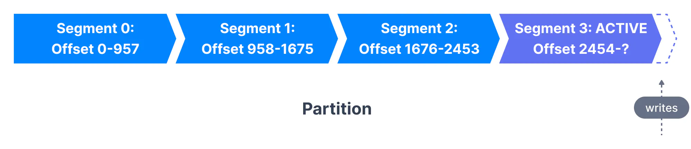
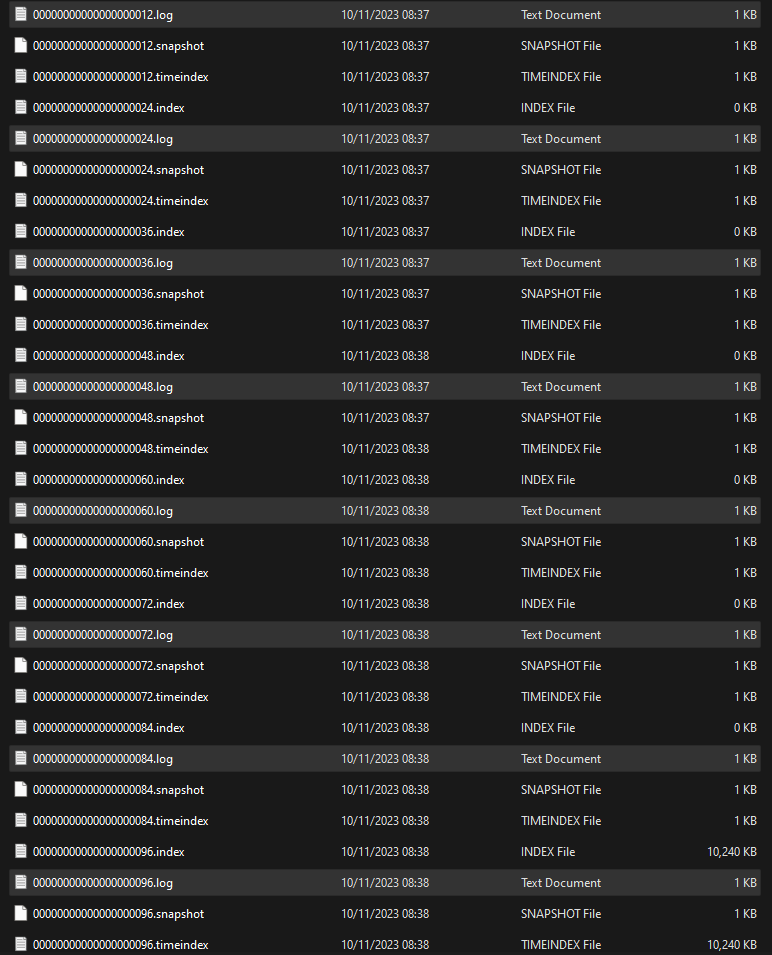

# Log Segments

Now, we'll take a deep dive into Kafka Internals and learn how Kafka handles topic storage with segments and indexes. Knowing the internals provides context when troubleshooting or trying to understand why Kafka behaves the way it does, and also helps you set configuration parameters.

The basic storage unit of Kafka is a partition replica. When you create a topic, Kafka first decides how to allocate the partitions between brokers. It spreads replicas evenly among brokers.

Kafka brokers splits each partition into __segments__. Each segment is stored in a single data file on the disk attached to the broker. By default, each segment contains either 1 GB of data or a week of data, whichever limit is attained first. When the Kafka broker receives data for a partition, as the segment limit is reached, it will close the file and start a new one:

Only one segment is ACTIVE at any point in time - the one data is being written to. A segment can only be deleted if it has been closed beforehand. The size of a segment is controlled by two Broker configurations (which can be modified at the topic level too):

__log.segment.bytes__: the max size of a single segment in bytes (default 1 GB)

__log.segment.ms__: the time Kafka will wait before committing the segment if not full (default 1 week)

In server.properties there is :

    # The maximum size of a log segment file. When this size is reached a new log segment will be created.
    log.segment.bytes=1073741824 # defaults to aprox. 1GB of data

We can change this number to see how Kafka handles log segments. To see this in action, we will reduce log.segment.bytes = 1000 (aprox. 0.001MB).

Start zookeeper, start server, create topic, start producer (which will be our python script main.py) and start consumer:

    kafka_2.12-3.6.0\bin\windows\zookeeper-server-start.bat  kafka_2.12-3.6.0\config\zookeeper.properties

    kafka_2.12-3.6.0\bin\windows\kafka-server-start.bat kafka_2.12-3.6.0\config\server.properties 

    kafka_2.12-3.6.0/bin/windows/kafka-topics.bat --create --topic log-segments --bootstrap-server localhost:9092--replication-factor 1 --partitions 1

    kafka_2.12-3.6.0/bin/windows/kafka-console-consumer.bat --bootstrap-server localhost:9092 --topic log-segments

Now start producer --> main.py script. It will generate 100 data points.
Go to Kafka_logs directory. What we can see is that  we have 9 log files ( 9 log segments) each 1KB in size (which is 1000bytes as we specified in server.properties file):

Each log segment contains 12 numbers from producer. Here is how 00000000000000000000.log looks like:

           E    #Àm        ‹¸*|q  ‹¸*|qÿÿÿÿÿÿÿÿÿÿÿÿÿÿ   &   {"number": 0}           E    ßgp        ‹¸*|Õ  ‹¸*|Õÿÿÿÿÿÿÿÿÿÿÿÿÿÿ   &   {"number": 1}           E    Ï*ñ!        ‹¸*}:  ‹¸*}:ÿÿÿÿÿÿÿÿÿÿÿÿÿÿ   &   {"number": 2}           E    }˜5        ‹¸*}Ÿ  ‹¸*}Ÿÿÿÿÿÿÿÿÿÿÿÿÿÿÿ   &   {"number": 3}           E    mç+s        ‹¸*~  ‹¸*~ÿÿÿÿÿÿÿÿÿÿÿÿÿÿ   &   {"number": 4}           E    -n£        ‹¸*~i  ‹¸*~iÿÿÿÿÿÿÿÿÿÿÿÿÿÿ   &   {"number": 5}           E    >ôÕ        ‹¸*~Î  ‹¸*~Îÿÿÿÿÿÿÿÿÿÿÿÿÿÿ   &   {"number": 6}            E    lù
            Ë        ‹¸*3  ‹¸*3ÿÿÿÿÿÿÿÿÿÿÿÿÿÿ   &   {"number": 7}           E    #÷É        ‹¸*˜  ‹¸*˜ÿÿÿÿÿÿÿÿÿÿÿÿÿÿ   &   {"number": 8}        	   E    ›&Ë        ‹¸*ý  ‹¸*ýÿÿÿÿÿÿÿÿÿÿÿÿÿÿ   &   {"number": 9}        
            F    ¹Q_Ú        ‹¸*€a  ‹¸*€aÿÿÿÿÿÿÿÿÿÿÿÿÿÿ   (   {"number": 10}           F    ))Æâ        ‹¸*€Æ  ‹¸*€Æÿÿÿÿÿÿÿÿÿÿÿÿÿÿ   (   {"number": 11} 

, when the max log file size is reached new log file is created (in our case 00000000000000000012.log, 00000000000000000024.log, etc.) 